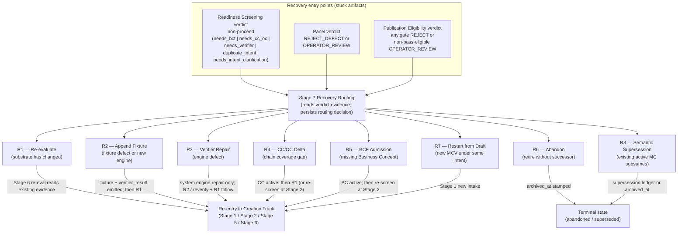
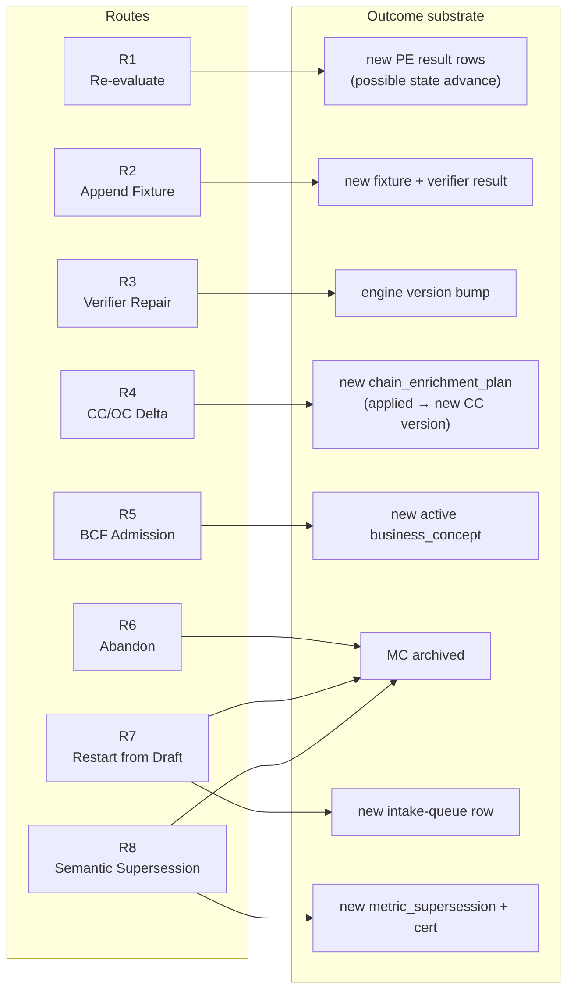

# Metric Management System — Recovery Track

## 1. Purpose and posture

This chapter is the operating doctrine for the **Recovery Track** of the Metric Management System (MMS). It fills in the per-route operational policy for **Stage 7 — Recovery Routing** of the Creation Track. Where the parent doctrine — [Metric Management System](metric-management-system.md) — names the eight canonical recovery routes (R1–R8) and their default verdict-to-route mappings, this chapter defines:

- the **decision flow** that takes a stuck candidate from a verdict on the ledger to one of the eight routes;
- the **operational policy per route** — preconditions, operator evidence required, owning surface, completion event;
- the **per-defect-code routing principle** for Self-Verification structural rejects (R2 vs R3);
- the **multi-route conflict discipline** when more than one route applies (e.g. R6 vs R8, R2 vs R3);
- the **catalog-visibility consequences** of each terminal route;
- the **recorded substrate specimens** (`billing_cycle_time`, `paid_customer_invoice_count_v2`) and the recommended route plan for each.

This chapter does not redefine any Creation Track stage, gate predicate, naming rule, or refactor sequencing. Those remain governed by the [parent MMS doctrine](metric-management-system.md). Where this chapter touches a Creation Track artifact (e.g. the `mcf.recovery_routing_decision` table proposed in MMS §7.1), it cites that authority and refines only the operational rules.

The Recovery Track doctrine is operator-authorised draft in the readiness baseline; no ADR is filed for this doctrine, no code or substrate has been mutated to reflect the doctrine, and no recovery routing decisions have been applied through this doctrine's discipline. The two Metric Contract Versions recorded as stuck on `bc_platform_dev` are inputs to this doctrine, not outputs of it.

## 2. Place inside MMS

Per [MMS §1A.4](metric-management-system.md), MMS organises its operational doctrine into four tracks. This chapter is the Recovery Track. The other three:

- **Creation Track** — intent → activation. Owned by [Metric Management System](metric-management-system.md) Stages 1–8.
- **Runtime Track** — tenant-runtime evaluation via the Metric Engine. Stage 9 in MMS is a cross-track touchpoint; the current chapter on runtime evaluation is [Metric Evaluation](metric-evaluation.md).
- **Evolution Track** — supersession, retirement, rebind on active metrics. Stage 10 in MMS is a cross-track touchpoint; the operating doctrine is a future chapter.

The Recovery Track reaches both into and out of the other tracks:

- **From Creation Track.** Recovery Routing (Stage 7) is the failure-mode handler for verdicts emitted by Stages 2 (Readiness Screening), 3 (Metric Draft Review), and 6 (Publication Eligibility Evaluation). Each non-pass verdict produces a stuck artifact; this chapter routes it.
- **Into Creation Track.** Routes R1, R2, R3, R4, R5, R7 are non-terminal — they produce a new artifact that re-enters the Creation Track flow (a fresh evaluation, a fresh fixture+verifier result, an engine bump that triggers re-evaluation, a Canonical Contract delta, a Business Concept admission, a fresh intake).
- **Into Evolution Track.** R8 (Semantic Supersession) on a post-activation candidate produces a `mcf.metric_supersession` row that the Evolution Track owns; R6 (Abandon) and R7 (Restart from Draft) are terminal for the original candidate but leave audit residue the Evolution Track may consume.
- **Into Runtime Track.** Recovery does not directly write to the Runtime Track. R1–R8 all complete before the candidate reaches active state; once active, runtime concerns are owned by the Metric Engine.

## 3. Authority and inputs

| Input | Role |
|---|---|
| [Metric Management System](metric-management-system.md) | Parent doctrine. Authority for the Creation Track flow, the nine semantic gates, the eight recovery routes, the verdict-to-route default mapping, the schema citations, the substrate naming. This chapter inherits all of those without restating them. |
| [Pre-doctrine decisions note](../evidence/work-records/implementation/mcf-final-operating-flow-pre-doctrine-decisions-2026-06-22.md) | The five locked draft decisions — Readiness Screening as gating service, Metric Intent as first-class artifact, two-layer duplicate-intent, exhaustive PE-MC-N mapping, Recovery Track as parallel doctrine (this chapter). |
| [MCF Framework Audit](../evidence/audits/implementation/mcf-framework-audit-2026-06-22.md) | Evidence base. §4 (MCV inventory) identifies the two stuck Metric Contract Versions; §5 (coverage matrix) names the verdict-to-route default; §6.1, §6.2, §6.4, §6.7 are the gaps this doctrine operationalises the response to. §8.1 portfolio shape vocabulary (formula shape × temporal gate shape — MMS §6.6) is referenced in route R3 (Verifier Repair). |
| [The Invariants](../foundation/the-invariants.md) | Foundation invariants. The recovery ledger is append-only (Invariant III); recovery decisions are non-replayable (Invariant V — each decision emits its evidence row and never rewrites a prior one); evidence is emitted, not inferred (Invariant VI). |
| [The Authority Model](../foundation/the-authority-model.md) | Authority ladder. Recovery routing decisions sit inside this ladder — operator-driven, cert-bearing where the route is cert-bearing, audit-trail-bearing always. |
| [ADR DEC-c3e57f / D422](../governance/adrs/ADR-c3e57f.md) | MCF foundational ADR. The cert grammar at Stage 4 (R7 restart-from-draft) and Stage 10 (R8 semantic supersession) is governed here. |
| [ADR DEC-739e23 / D446](../governance/adrs/ADR-739e23.md) | Chain Enrichment Engine. The v1 increment is the host for R4 (Canonical Contract / Observation Contract Delta). |
| [ADR DEC-957fb0 / D434](../governance/adrs/ADR-957fb0.md) | Editorial rebind evidence. The existing rebind controller surfaces this for R7 and is referenced by R8 (pre-activation supersession-via-abandon). |
| Substrate (Drizzle): `bc-core/src/database/schema/mcf/` | 24 schema files. Specific tables: `metric_contract`, `metric_contract_version`, `metric_supersession`, `metric_publication_eligibility_result`, `metric_self_verification_fixture`, `metric_self_verification_result`, `chain_enrichment_plan`, `certification_record`. |
| Existing surfaces (controllers) | `mcf-publication-eligibility.controller.ts` (R1), `mcf-mcv-fixture-append/mcf-mcv-fixture-append.controller.ts` (R2), `chain-enrichment/chain-enrichment.controller.ts` (R4 v1+), `mcf-mcv-abandon.controller.ts` (R6), `mcf-intake.controller.ts` (R7), `mcf-mcv-supersede.controller.ts` (R8 post-activation), `mcf-mcv-rebind.controller.ts` (R7-variant when bindings change but identity is editorial). |

## 4. Recovery decision flow

### 4.1 The decision-flow diagram



*Diagram DG-mms-recovery-decision-flow.*

**R3 arrow footnote.** The R3 arrow label is compact for diagram readability; the productive candidate sequence for a metric routed to R3 is **R3 (system engine repair) → R2 with a non-duplicate fixture variant (or future reverify-existing-fixture primitive per §10.2) → R1 (re-evaluate)**. R3 alone does not re-enter Creation Track for the candidate. Per §5.3, R3's system-level surface ships the engine; it does not write candidate-level verifier_result rows. R1 then reads the verifier_result that R2 / reverify emitted — R1 itself emits no verifier evidence.

**R1 arrow footnote.** R1 reads existing evidence at every gate; it does not create evidence at any gate. The "Stage 6 re-eval" label is shorthand for "invoke the Publication Eligibility evaluator against the substrate as it stands"; the substrate change that makes the gate likely to pass is produced by a prior route (R2 / R4 / R5 / R7 / etc.), recorded on its own recovery-routing-decision row, **before** R1 runs.

### 4.2 The three entry points

A candidate enters Stage 7 from one of three places:

| Entry | Stuck artifact | Verdict source | Verdict carrier |
|---|---|---|---|
| **E1 — Readiness Screening non-proceed** | `mcf.readiness_screening_result` (proposed; per MMS §8.3) | Stage 2 | `verdict_code` ∈ {`needs_bcf`, `needs_cc_oc`, `needs_verifier`, `duplicate_intent`, `needs_intent_clarification`} |
| **E2 — Panel rejection or substantive operator review** | `mcf.metric_authoring_panel_run` | Stage 3 | `consensus_payload_json.verdict_code` ∈ {`REJECT_DEFECT`, `OPERATOR_REVIEW`} |
| **E3 — Publication Eligibility partial-pass or REJECT** | `mcf.metric_contract_version` in `governance_state_code = 'review'` plus the `mcf.metric_publication_eligibility_result` rows that constitute the verdict | Stage 6 | Per-gate `verdict_code` ∈ {`PASS`, `REJECT`, `OPERATOR_REVIEW`} aggregated to review-only per MMS §4.5 |

All three entries write to the same recovery-routing-decision ledger (§4.5). The route table in §5 lists the recovery action per verdict; the multi-route conflict discipline in §7 governs when more than one route applies to the same stuck artifact.

### 4.3 The verdict evidence the operator reads

Stage 7 is operator-driven; the orchestration service surfaces the verdict evidence but does not auto-select the route except in the deterministic cases noted in MMS §5.2. The operator reads:

- The **verdict code** itself (the substrate enum value).
- The **gate identity** (which of G1–G9, or which Readiness Screening verdict, or which panel defect code).
- The **predicate evidence** the gate emitted — for G3 (Source-Chain Resolvability), this is the unresolvable Business Concept(s); for G5 (Self-Verification) it is the verifier result row's `verdict_code` and `defect_code`; for G8 (Duplicate Intent — canonical) it is the colliding active MC's `metric_contract_uid`.
- The **substrate state** at the moment of verdict — was the active CC version N or N+1, was the engine version mcf-m13-v5 or v6.
- The **operator's prior decisions** on the same parent MC, if any (e.g. a previous abandon-and-restart cycle).

The Recovery Track doctrine does **not** prescribe a UI for this surface — that is operator console work. The doctrine prescribes the **evidence set** that must be available to the operator at the moment of decision, regardless of UI form.

### 4.4 The route selection process

The default mapping in MMS §5.2 gives the recommended route per verdict. The Recovery Track doctrine treats the default as binding *unless* an explicit operator override with rationale is recorded. The override path is:

1. Operator reads the verdict evidence (§4.3).
2. Operator considers the multi-route conflict discipline (§7) when applicable.
3. Operator either accepts the default route or selects an alternative.
4. Operator records the chosen route plus a rationale (≥ 40 chars, consistent with the 40-char minimum in the existing `mcf-mcv-abandon.controller.ts` `readAbandonGates`).
5. The orchestration service persists the decision (§4.5).
6. The route's owning surface is invoked (§5 per-route).

### 4.5 The `mcf.recovery_routing_decision` artifact

Proposed per [MMS §7.1](metric-management-system.md). The shape per the Recovery Track doctrine:

```
mcf.recovery_routing_decision
─────────────────────────────────────────────────────────────────────
recovery_routing_decision_uid    uuid  PK
source_entry_kind                text  CHECK (∈ {'readiness_screening',
                                                  'panel_run',
                                                  'publication_eligibility'})
source_artifact_uid              uuid  -- FK to one of the three entry tables
source_verdict_summary_json      jsonb -- denormalised snapshot of verdict + gate(s) + predicate evidence
chosen_route_code                text  CHECK (∈ {'R1','R2','R3','R4','R5','R6','R7','R8'})
default_route_code               text  CHECK (same enum or NULL)
override_indicator               boolean -- TRUE iff chosen_route_code ≠ default_route_code
operator_rationale_text          text  CHECK (length(text) >= 40)
operator_sub                     uuid  -- the authenticated operator
related_artifact_uid             uuid  -- FK to the artifact this decision references (e.g. successor MC for R8)
produced_artifact_uid            uuid  NULLABLE -- FK to the artifact the route produces (filled in when route completes)
produced_artifact_kind           text  NULLABLE
completion_event_at              timestamptz  NULLABLE
created_at                       timestamptz  NOT NULL DEFAULT now()
created_by_name                  text
```

**Discipline rules.**

- One row per (stuck artifact, chosen route). A candidate that needs two routes — e.g. R4 *and* R3 in parallel — emits two rows, not one.
- `source_verdict_summary_json` is denormalised at write-time so the audit trail is legible even if upstream substrate is later archived.
- `override_indicator` is computed at write-time, not in the application layer.
- `produced_artifact_uid` is null until the route's owning surface reports completion. A row with `produced_artifact_uid IS NULL` after a stale window is a recovery-stalled signal.
- Foundation Invariant III applies: rows are append-only. A re-decision (operator changes mind before completion) creates a new row with the prior row referenced in `source_verdict_summary_json.supersedes_decision_uid`.

The substrate table itself is proposed; the substrate DDL is not authorised by this doctrine. The Controlled Semantic Refactor is authoritatively defined by **[ADR DEC-54f221 / D449](../governance/adrs/ADR-54f221.md)** (three-layer model — Interpretation Surfaces / Implementation Names / Compatibility Names; supersedes DEC-7a1c98's six-step sequence). The recovery-routing-decision table lands in Layer 3 (Compatibility Names) per that ADR.

## 5. Per-route operational policy

Each route below has the same five-element shape: **when applicable**, **preconditions**, **operator evidence**, **owning surface**, **completion event**.

### 5.1 R1 — Re-evaluate

**Universal rule.** R1 reads existing evidence; it does **not** create evidence. R1 invokes the Publication Eligibility evaluator against the substrate as it stands at invocation time. R1 does not write fresh `mcf.metric_self_verification_result` rows, does not bump engine versions, does not extend the Canonical Contract / Observation Contract / Source Contract / Admission Contract chain, does not modify variable bindings, does not re-stamp package signatures. Every R1 invocation requires the artifact read by the previously-rejecting gate to **already** carry the change that makes the gate pass. The route that produces that change is a separate recovery-routing-decision row (R2, R3-then-R2, R4, R5, R7-rebind, etc.) that completes **before** R1 runs.

**When applicable.** The artifact each previously-failing gate reads has changed since the gate emitted its REJECT, and the change makes the gate likely to pass. Triggers by gate family:

- **Chain-side gates (G3 Source-Chain Resolvability, G4 Source-Vocabulary Discipline, G9 Provenance Grounding).** The active CC / OC / SC / AC chain or BCF citation chain has been extended or corrected (R4 / R5 / R7 completed upstream).
- **Binding-side gates (G1 Identity Uniqueness, G2 Binding Integrity, G7 Lifecycle Authority, G8 Duplicate Intent).** The MCV's bindings or the surrounding identity surface has been corrected (typically R7-rebind, or a prior R6 + R7 sequence that archived a colliding parent MC).
- **Verifier-side gates (G5 Self-Verification, G6 Package Signature Currency).** The candidate's **gate-read** `mcf.metric_self_verification_result` row has been refreshed by R2 (append-fixture) or the future reverify-existing-fixture primitive (per §10.2). For **G5**, the gate-read result row must carry the relevant `verifier_algorithm_version` (post-repair if R3 was needed) and a verdict the operator can read at G5. For **G6**, the gate-read result row's `bound_package_signature_hash_at_run` must equal the candidate MC's package signature hash in force. **A system-level R3 completion alone (engine repair shipped, verifier portfolio regression suite green) is NOT sufficient for G5 — R3 ships system-level repair; the candidate-level verifier_result must be re-emitted via R2 or future reverify before R1 reads it.** Likewise for G6: R1 does not re-stamp the verifier_result with the package signature; a new verifier_result must be emitted whose `bound_package_signature_hash_at_run` equals the MC's hash in force.

**Preconditions.**

- The candidate MCV is in `governance_state_code = 'review'` (re-evaluation from review is a first-class flow per [MMS §3.6](metric-management-system.md)).
- The artifact the rejecting gate reads has materially changed since the gate's last REJECT, **at the substrate layer the gate reads** — per the gate-family enumeration above. For G5 and G6 specifically, this means a **new** `mcf.metric_self_verification_result` row exists for this MCV (produced by R2 or future reverify, not by R1 itself).
- No active recovery-routing-decision row for this MCV is pending (i.e. no other route is mid-flight).

**Operator evidence.** Operator records which substrate change is being relied on, naming the upstream R-route completion that justifies the re-evaluation **per the gate it addresses**. Examples: "CC version A → version B landed; R4 completed; addresses G3"; "fresh fixture + `metric_self_verification_result` row emitted under post-repair `verifier_algorithm_version = 'mcf-verifier-v2'`; R2 completed as R3's candidate-level layer per §5.3; addresses G5". For G5 the rationale must explicitly cite the candidate-level evidence refresh (not just the system-level engine repair).

**Owning surface.** Existing `mcf-publication-eligibility.controller.ts` evaluate endpoint.

**Completion event.** New `mcf.metric_publication_eligibility_result` rows are emitted; MCV state may advance `review → approved` (and hash columns stamped) if all gates pass-eligible after re-evaluation, or stay at `review` with fresh REJECT evidence appended. The recovery-routing-decision row's `produced_artifact_uid` is filled with the produced PE result-set evidence reference and `completion_event_at` is stamped. Per Foundation Invariant V, the prior PE rows are never rewritten.

### 5.2 R2 — Append Fixture

**When applicable.** Self-Verification (G5) failed and the diagnosis is a **fixture-side defect** (the fixture is wrong, the engine is fine), OR the operator judges that the existing fixture under-tests the metric, OR an engine extension has shipped that may make a previously-failing fixture pass.

**Preconditions.**

- Candidate MCV in `governance_state_code = 'draft'` or `'review'` (the existing `mcf-mcv-fixture-append.controller.ts` accepts both per controller line 8).
- A prior `mcf.metric_self_verification_fixture` row exists for this MCV (the controller refuses no-prior-fixture).
- The new fixture body hash differs from any prior fixture's hash (the controller refuses duplicates with 409).

**Operator evidence.** Operator records why the existing fixture is insufficient — typically by naming the specific Section A inputs that need expansion, the Section B expected output that needs refinement, or the Section C resolver config that needs correction.

**Owning surface.** Existing `mcf-mcv-fixture-append/mcf-mcv-fixture-append.controller.ts`. A single endpoint call emits **both** a new `mcf.metric_self_verification_fixture` row **and** a new `mcf.metric_self_verification_result` row under the current engine (per the controller docstring lines 50–55). The append endpoint bundles fixture + verifier_result emission; no separate Stage 5 invocation is needed.

**Completion event.** New fixture + result rows present; Stage 6 re-evaluation (R1) typically follows in the operator's recovery sequence. The recovery-routing-decision row's `produced_artifact_uid` points at the new fixture; `completion_event_at` is stamped. R2 alone is not terminal — the operator must invoke R1 to surface the new result through G5.

### 5.3 R3 — Verifier Repair

**When applicable.** Self-Verification (G5) failed and the diagnosis is an **engine-side defect** (the fixture is well-formed but the engine cannot evaluate it correctly), per [Audit §6.4](../evidence/audits/implementation/mcf-framework-audit-2026-06-22.md) verifier portfolio gap. The R2-vs-R3 diagnostic principle is in §6 below.

**Preconditions.**

- Candidate MCV's verifier result carries `verdict_code = 'fail'` or `verdict_code = 'structural_reject'` with a defect code that diagnoses to engine-side (per §6).
- The operator has determined the failure is not addressable by appending a fixture (R2).

**Operator evidence.** Operator records the specific engine path that failed — the NODE_KIND, the formula-shape-and-temporal-gate-shape combination (per [MMS §6.6](metric-management-system.md)), and the diagnostic evidence (verifier result row's `verdict_payload_json`, the formula AST node, the substrate values the engine read).

**Owning surface (system-level only).** **Engine repair work — out of stage-flow scope.** R3 does not have a single MCF controller; it dispatches to the verifier-engine track, which is the host for [Audit §6.4](../evidence/audits/implementation/mcf-framework-audit-2026-06-22.md) verifier-portfolio work. The route's **system-level** owning surface is the engine implementation in `bc-core/src/registry/mcf/formula-execution.engine.ts`, the verifier portfolio test suite, and the regression-suite work that blocks engine version bumps. **This surface ships the engine repair; it does NOT write candidate-level `mcf.metric_self_verification_result` rows for any specific MCV.** Candidate-level completion of R3 against a specific MCV (per the two-layer rule below) is produced by R2's append-fixture path (a new fixture + verifier_result emission against the post-repair `verifier_algorithm_version`) or by the future reverify-existing-fixture primitive (per §10.2). Those are separate routes with their own owning surfaces. The division of labour is: **R3 owns the engine repair; R2 (or future reverify) owns the candidate-level emission; R1 reads what R2 / reverify wrote but produces no verifier evidence itself.**

**Completion event — two layers, both required.** R3 has a **system-level completion** (necessary) and a **candidate-level completion** (also necessary; required before R1 Re-evaluate can run productively against this MCV).

- **System-level completion.** A **Self-Verification engine algorithm bump** shipped — recorded as a new value of the `verifier_algorithm_version` column on `mcf.metric_self_verification_result` (e.g. `mcf-verifier-v1` → `mcf-verifier-v2`). This is the M10 self-verifier algorithm version per [M10 closeout](../evidence/closeouts/implementation/mcf-m10-apply-closeout.md) (regex `^mcf-[a-z-]+-v[0-9]+$`), and it is **distinct** from the M13 Publication Eligibility evaluator version (column `verifier_version` on `mcf.metric_publication_eligibility_result`). R3 bumps the M10 verifier algorithm, not the M13 evaluator. Alongside the algorithm bump, a new fixture in the verifier portfolio covers the previously-failing path, and the regression suite blocks further engine bumps until the new fixture passes. This is necessary system evidence — without it, the same evaluation path will fail again. But it is **not sufficient** candidate evidence. The candidate's gate-read `mcf.metric_self_verification_result` row still carries the pre-repair `verifier_algorithm_version` and a `fail` verdict; G5 reads the gate-read verifier result for this MCV, so re-evaluation under R1 would re-surface the same stale failure.

- **Candidate-level completion.** Fresh Self-Verification evidence under the repaired engine for **this** candidate. Two paths produce that evidence:

  1. **Via R2 — Append Fixture with a non-duplicate fixture variant.** The operator appends a new fixture (different body hash than any prior; the existing `mcf-mcv-fixture-append.controller.ts` refuses duplicates per controller line 64) under the repaired engine version. The append endpoint bundles fixture + verifier_result emission (per [§5.2](#52-r2--append-fixture)); the new verifier_result row carries the post-repair `verifier_algorithm_version` and a verdict the operator can read.

  2. **Via a future reverify-existing-fixture primitive (deferred — not implemented in the readiness baseline).** The substrate already supports a fresh result row against an existing fixture under a different engine version: `mcf.metric_self_verification_result`'s UNIQUE constraint is `(fixture_uid, verifier_algorithm_version, bound_package_signature_hash_at_run)`, so a new row under the same `fixture_uid` is admissible when `verifier_algorithm_version` differs (and a post-repair engine bump changes that value). The missing piece is the endpoint that emits the new result row against the **existing** fixture without requiring a new fixture variant. This primitive is named in §10.2 as a deferred surface — outside the readiness baseline.

Until the reverify primitive lands, the operator uses path 1 (R2 with a non-duplicate fixture variant). The recovery-routing-decision row for R3 records the system-level completion (engine version bump marker); a separate recovery-routing-decision row for the follow-up R2 records the candidate-level completion (new fixture + new verifier_result).

**R3 alone is not terminal, and R3 → R1 alone is also not productive.** The operator sequence is: R3 (engine repair, system-level) → R2 or future reverify (candidate-level fresh evidence) → R1 (re-evaluate against the new evidence). Recovery-routing-decision rows are emitted for each step; the audit trail is the chain of three rows linked by `related_artifact_uid`.

### 5.4 R4 — Canonical Contract / Observation Contract Delta

**When applicable.** Source-Chain Resolvability (G3) rejected because a binding's Business Concept is not declared by the active Canonical Contract's `field_selection`, or the Observation Contract chain back to source is incomplete. This is the Chain Enrichment Engine v1 host per [Audit §6.3](../evidence/audits/implementation/mcf-framework-audit-2026-06-22.md).

**Preconditions.**

- The unresolvable Business Concept is an *active* row in `concept_registry.business_concept` (if it is missing entirely, route R5 first).
- The Canonical Contract or Observation Contract on the candidate's grain entity exists in the substrate (R4 extends; if a CC on the grain does not exist at all, R4 still applies and the chain authoring will produce v1).
- No `mcf.chain_enrichment_plan` row in `pending` or `applied` state for the same gap is already recorded.

**Operator evidence.** Operator records the gap evidence — the unresolvable Business Concept ID, the active Canonical Contract version, the chain link that needs extension (CC field_selection, OC field_map, AC source-reference). The evidence is structured for the Chain Enrichment Engine planner.

**Owning surface.** Chain Enrichment v1+ — extends the existing `chain-enrichment/chain-enrichment.service.ts` planner with a `canonical_contract_gap_plan` mode (per [Audit §6.3](../evidence/audits/implementation/mcf-framework-audit-2026-06-22.md)). CEE remains planner-only (`mcf.chain_enrichment_plan` is the only write surface); the harness applies the plan; the audit-first loop verifies.

**Completion event.** Chain Enrichment plan is applied (a new CC version is active, or an OC field_map is extended). The recovery-routing-decision row's `produced_artifact_uid` references the chain_enrichment_plan row; `completion_event_at` is stamped when the plan reaches `applied`. The operator then invokes R1 (Re-evaluate) to surface the new CC through G3.

### 5.5 R5 — Business Concept Framework Admission

**When applicable.** A binding's Business Concept does not exist in the active concept registry — either the Readiness Screening verdict is `needs_bcf`, or a panel-proposed Business Concept did not match any active registry row.

**Preconditions.**

- The Business Concept is missing entirely (not present as `lifecycle_state = 'superseded'` either — if a prior superseded version exists, this is closer to R4 with a successor mapping than R5).
- The operator has the Business Concept Draft Review (B6) panel + Operator Certification (C5) + Registry Write (F3) flow available.

**Operator evidence.** Operator records the candidate Business Concept's identity (entity + characteristic + representation term), the citation evidence supporting admission, and the relationship to the stuck candidate's bindings.

**Owning surface.** Business Concept Framework authoring flow — Business Concept Draft Review (B6 panel) → Operator Certification (C5) → Registry Write (F3). This is the BCF stack, not the MMS stack; this chapter refers to it without redefining it.

**Completion event.** The new Business Concept reaches `lifecycle_state = 'active'`. The recovery-routing-decision row's `produced_artifact_uid` references the new `concept_registry.business_concept.concept_id`; `completion_event_at` is stamped at BCF activation. The operator then re-screens (Stage 2 produces a fresh `mcf.readiness_screening_result`) and, if the verdict is `proceed`, proceeds through Creation Track from Stage 3; if the verdict is `needs_cc_oc`, R4 follows.

### 5.6 R6 — Abandon

**When applicable.** The candidate cannot be salvaged under any chain-side or engine-side delta, and the operator does not intend to designate a semantic successor. The candidate is retired without naming an absorbing active Metric Contract.

**Preconditions.**

- Candidate MCV in `governance_state_code = 'draft'` or `'review'` (the existing `mcf-mcv-abandon.controller.ts` accepts both per `readAbandonGates`).
- Parent MC is not already archived (idempotency — abandon refuses re-archive).
- Parent MC has no active MCV (abandon refuses to archive a parent that carries a live version).

**Operator evidence.** Operator records the reason the candidate is unsalvageable — typically a multi-gate rejection where no single route resolves the failure set, or an intent that the operator no longer wants to pursue. Rationale ≥ 40 chars (controller-enforced).

**Owning surface.** Existing `mcf-mcv-abandon.controller.ts`. The single write is `mcf.metric_contract.archived_at` stamped; the MCV row is **never mutated** (Foundation Invariant III preserved).

**Completion event.** Parent MC `archived_at` is set; the `mc_name` is freed for future authoring (the partial unique index `idx_mcf_mc_mc_name_active` excludes archived rows). Recovery-routing-decision row's `produced_artifact_uid` references the archived MC; `completion_event_at` is stamped. **R6 is terminal for the original candidate** — no future route can revive this MC; the operator must restart via R7 if the intent is to author a new candidate with the same name or refined bindings.

### 5.7 R7 — Restart from Draft

**When applicable.** The bindings, the formula, the temporal gate, the grain, or some other identity-bearing facet of the original candidate is wrong, but the metric **intent** is still right. A new Metric Contract under a refined Metric Intent should replace the stuck one. R7 is the "try again with what we learned" route.

**Preconditions.**

- The original candidate is or will be abandoned (R6 typically completes in the same operator decision, or the original is already archived from a prior R6).
- The operator has a refined Metric Intent — at minimum, an updated intent statement that reflects what was learned from the stuck attempt.

**Operator evidence.** Operator records what changed between the original Intent and the refined Intent — which binding was wrong, which temporal anchor was misidentified, which formula shape was misclassified. The refined Intent is the basis for the new intake.

**Owning surface.** A combination — `mcf-intake.controller.ts` (new intake-queue row with refined Intent), `mcf-mcv-abandon.controller.ts` (abandon the prior MC if not already), and optionally `mcf-mcv-rebind.controller.ts` per [DEC-957fb0 / D434](../governance/adrs/ADR-957fb0.md) when the change is editorial-only (variable role rebinding without altering identity tuple). Three surface variants:

- **R7-fresh.** Full restart with a new MC UID. The prior is abandoned (R6). The new candidate enters at Stage 1 with the refined Intent.
- **R7-rebind.** Editorial rebind via the rebind controller — a new draft MCV under the *same* parent MC, with named variable role rebindings (e.g. `cycle_end_anchor` rebound from sent_date BC to delivery_date BC). The prior MCV remains in the audit trail.
- **R7-revision.** A new MCV under the same parent MC for descriptive changes only (display name, threshold, function code). The identity tuple is unchanged; this is M3 revision territory.

**Completion event.** A new intake-queue row in `pending`, or a new draft MCV under the existing parent. The recovery-routing-decision row's `produced_artifact_uid` references the new intake or new MCV; `completion_event_at` is stamped at creation. R7 hands off to the standard Creation Track flow — the new candidate then traverses Stages 2 through 8.

### 5.8 R8 — Semantic Supersession

**When applicable.** The stuck candidate's intent is already satisfied by an existing active Metric Contract. The stuck candidate is retired and the existing active MC continues to serve the intent. R8 differs from R6 in that R8 requires the operator to **name** the absorbing active MC.

**Preconditions.**

- An active Metric Contract exists that the operator can credibly name as the semantic successor (its formula, bindings, grain, and temporal gate combine to satisfy the stuck candidate's Intent).
- The stuck candidate's status determines the substrate path:
  - **R8-post-activation.** The stuck candidate is itself an active MCV (e.g. a pre-existing active MC whose intent is better served by a newer active sibling). The supersede controller writes `mcf.metric_supersession`.
  - **R8-pre-activation.** The stuck candidate is in `governance_state_code = 'draft'` or `'review'`. The substrate path is abandon (R6 mechanics) but the recovery-routing-decision row carries the semantic-successor reference.

**Operator evidence.** Operator records the absorbing active MC's `metric_contract_uid` plus a comparison: how the existing active MC's identity tuple subsumes the stuck candidate's Intent. The comparison is structured so future audit can validate the supersession decision against substrate.

**Owning surface.**

- R8-post-activation — existing `mcf-mcv-supersede.controller.ts` + `McfCertWriterService.supersedeMetric`. The substrate write includes a `mcf.certification_record` row with `action_code = 'metric_supersede'` and a `mcf.metric_supersession` link row.
- R8-pre-activation — `mcf-mcv-abandon.controller.ts` for the substrate write, with the recovery-routing-decision row carrying `related_artifact_uid` pointing at the absorbing active MC (no `metric_supersession` row, since the substrate `mcf.metric_supersession` CHECK requires both predecessor and successor MCVs to exist and the pre-activation candidate has no MCV in a state that supports linkage).

**Completion event.**

- R8-post-activation — supersession cert + `metric_supersession` row + MCV `active → superseded` state transition committed atomically.
- R8-pre-activation — parent MC `archived_at` stamped; recovery-routing-decision row carries the absorbing MC reference for audit.

Both variants are terminal for the stuck candidate.

## 6. Per-defect-code routing for G5 structural rejects (R2 vs R3)

The Self-Verification Gate (G5) emits one of three verdicts per MMS §4.1: `pass`, `fail`, `structural_reject`. The `structural_reject` verdict carries one of eleven `C-FX-*` defect codes from `FixtureStructuralCheckService.runStructuralChecks` (per M9 closeout). The recovery route depends on whether the defect is fixture-side (R2 — Append Fixture) or engine-capability-side (R3 — Verifier Repair).

### 6.1 The diagnostic principle

A defect is **fixture-side (R2)** if it identifies a malformed or insufficient property of the operator-supplied fixture body — Section A inputs that don't satisfy the formula's input requirements, Section B expected outputs whose shape does not match the formula's output shape, Section C resolver config that fails to specify how to resolve a variable role.

A defect is **engine-capability-side (R3)** if it identifies a property of the formula AST that the engine's NODE_KINDS coverage cannot handle — a temporal-gate-shape value (per [MMS §6.6](metric-management-system.md)) the engine does not implement, a formula-shape value paired with a filter or aggregation that the engine has not been hardened against, an arithmetic edge case (e.g. division by zero in a denominator the engine does not guard).

The two failure classes route to different surfaces with different time horizons — R2 completes in operator time (minutes), R3 completes in engineering time (days to weeks, gated on the engine portfolio per [Audit §6.4](../evidence/audits/implementation/mcf-framework-audit-2026-06-22.md)).

### 6.2 Operator diagnostic questions

When G5 returns `structural_reject`, the operator asks, in order:

1. **Does the defect code identify a Section A / B / C content problem?** If yes — fixture-side → R2.
2. **Is the fixture's expected output shape a legal target for the formula AST under the current engine?** If no — fixture-side → R2.
3. **Has the engine evaluated this combination of formula shape × temporal gate shape × filter dimension successfully on any prior metric?** If no — engine-side → R3.
4. **Does the `verifier_algorithm_version` on the candidate's gate-read `mcf.metric_self_verification_result` row match the shipped M10 self-verifier algorithm version used by G5?** If no — i.e. the candidate's gate-read verifier_result is stale relative to the repaired verifier/engine — produce fresh candidate-level verifier evidence **first** via R2 (append a non-duplicate fixture variant under the applicable verifier algorithm version) or the future reverify-existing-fixture primitive (when it lands, per §10.2), **then** invoke R1 to re-evaluate G5 against the fresh result. R1 alone does not refresh the verifier_result row — R1 reads the gate-read result; if that row is stale relative to the applicable `verifier_algorithm_version`, R1 will surface the same stale failure. This is the M10 self-verifier algorithm version (column `verifier_algorithm_version` on `mcf.metric_self_verification_result`), distinct from the M13 Publication Eligibility evaluator version (column `verifier_version` on `mcf.metric_publication_eligibility_result`); only the M10 version controls the verifier-result freshness G5 reads.

### 6.3 Exhaustive C-FX-N mapping (deferred)

The exhaustive per-C-FX-N → R2/R3 mapping is **not** locked in this doctrine. The mapping requires the verifier portfolio work named in [Audit §6.4](../evidence/audits/implementation/mcf-framework-audit-2026-06-22.md) to land, after which each C-FX-N can be classified empirically. This Recovery Track doctrine establishes the principle and the operator diagnostic discipline; the exhaustive table is a follow-up artifact tracked alongside the verifier portfolio.

Until the exhaustive mapping lands, the operator decision is recorded in the recovery-routing-decision row with the operator's rationale carrying the diagnostic answer to §6.2's questions. Multi-route conflict discipline (§7) applies when the diagnosis is ambiguous.

## 7. Multi-route conflicts

A stuck candidate may admit more than one recovery route. The operator's discipline is:

### 7.1 Multi-gate REJECT — one route per gate

A candidate that fails more than one gate emits one recovery-routing-decision row per failing gate. Example: `billing_cycle_time` fails both G3 (Source-Chain Resolvability) and G5 (Self-Verification). The operator records:

- One row routing G3 REJECT → R4 (CC delta to add the sent_date and document_date BCs to the Customer Invoice slice).
- One row routing G5 REJECT → R2 or R3 depending on the verifier diagnosis.

Re-evaluation (R1) is invoked only after **all** pending recovery routes for the candidate are complete.

### 7.2 R2 vs R3 — diagnostic ambiguity

When the operator cannot diagnose whether a G5 REJECT is fixture-side or engine-side from the verdict evidence alone, the default is **R2 first**: append a fixture variant designed to isolate the defect. If the second verifier result also fails on the same C-FX-N code under a deliberately-clean fixture, the diagnosis tightens to engine-side and R3 follows.

This "R2 first as diagnostic" pattern is operator-judgment, not a substrate rule. The recovery-routing-decision rationale records the diagnostic intent.

**Sequencing note when R3 ends up being needed.** Per §5.3, R3 is a two-layer completion: the engine repair (system-level) is necessary but not sufficient; the candidate also needs **fresh candidate-level Self-Verification evidence** under the repaired engine. The diagnostic R2 fixture (variant A) under the *pre-repair* engine does not provide that evidence — its result row is preserved under the old engine version per Invariant III. After R3's system-level completion, the operator invokes R2 **again** with a new fixture variant (variant B) under the post-repair engine, or uses the future reverify-existing-fixture primitive (§10.2) when it lands. The sequence is therefore R2-diagnostic → R3 → R2-candidate-evidence → R1.

### 7.3 R6 vs R8 — terminal-state choice

The distinction is whether the operator names a semantic successor.

- **R6 (Abandon).** The candidate is retired without a successor. The intent is dropped, deferred, or considered satisfied-by-nothing-the-operator-wants-to-name. No supersession evidence is recorded.
- **R8 (Semantic Supersession).** The candidate is retired *because* an existing active MC subsumes the intent. The operator must name the absorbing MC's UID. Post-activation R8 produces a `metric_supersession` ledger row; pre-activation R8 archives the parent MC and records the successor reference in the recovery-routing-decision row.

A candidate that *could* be R8 may still be R6 — the operator decides whether to record the semantic relationship. The audit-trail strength is asymmetric: R8 leaves an explicit successor link; R6 does not. Future audit reading the substrate sees an R6 candidate as "abandoned, no successor named" and an R8 candidate as "abandoned, absorbed by MC X."

### 7.4 R6 vs R7 — abandon-and-stop vs abandon-and-retry

When the candidate is unsalvageable but the *intent* is still valid:

- **R6 alone.** The operator drops the intent — perhaps the metric was a speculative authoring attempt that the operator no longer wants to pursue.
- **R6 then R7.** The candidate is abandoned (R6) and a refined Metric Intent enters a new intake (R7). The two are recorded as a paired sequence — R6 followed by R7 referencing the abandoned MC's UID in `related_artifact_uid`.

The pairing is operationally common when the failure was a binding mistake the operator has learned how to correct. The audit trail shows the original attempt, the abandon decision, and the restart's relationship to the original — useful for future operators investigating why a metric name was previously archived.

### 7.5 R7 variant selection (R7-fresh vs R7-rebind vs R7-revision)

Per §5.7's three variants:

- **R7-fresh** — when the candidate's identity tuple needs to change in ways that cross the formula / bindings / grain / temporal-gate / filter boundary. A fresh MC + MCV is the only legal path; the prior MC is abandoned.
- **R7-rebind** — when only variable role bindings change and the formula AST, grain, and temporal gate stay the same. The rebind controller writes a new MCV under the existing parent MC; the prior MCV remains in the audit trail under the same parent.
- **R7-revision** — when only descriptive fields change (display name, threshold, function code). No identity change; M3 revision substrate handles this.

The operator selects the variant by comparing the original identity tuple to the proposed identity tuple. If any identity-bearing field changes, R7-fresh; if only variable role bindings change, R7-rebind; if only descriptive fields change, R7-revision.

## 8. Catalog-visibility consequences

A metric's appearance in the platform's active catalog is governed by `mcf.metric_contract.archived_at IS NULL` (the partial unique index `idx_mcf_mc_mc_name_active` excludes archived rows) and by the MCV `governance_state_code` (`active` MCVs are catalog-visible; `draft`, `review`, `approved`, `superseded` are not).

Recovery-route terminal effects on catalog visibility:

| Route | Active catalog effect | Audit-trail evidence |
|---|---|---|
| R1 — Re-evaluate | None until completion. If R1 advances MCV to `approved` and Stage 8 activates, the MC enters active catalog. | New PE result rows; possibly a new activation cert. |
| R2 — Append Fixture | None until R1 completes. | New fixture + verifier result rows. |
| R3 — Verifier Repair | None until engine ships, post-repair candidate-level evidence is emitted (via follow-up R2 or future reverify primitive per §5.3), and R1 completes. | Engine version bump record (system-level); new fixture + verifier result row under post-repair engine (candidate-level); new PE result rows on R1. |
| R4 — CC/OC Delta | None for the candidate; the active catalog of Canonical Contracts changes (new CC version active). | New `mcf.chain_enrichment_plan` + downstream CC version. |
| R5 — BCF Admission | None for the candidate; the active concept registry changes (new BC active). | New `concept_registry.business_concept` row + cert. |
| R6 — Abandon | Parent MC removed from active catalog (`archived_at` stamped). `mc_name` freed. | Recovery-routing-decision row; no successor reference. |
| R7-fresh | Same as R6 for the prior; new MC enters catalog if it reaches activation. | Recovery-routing-decision row chaining R6 → R7; new intake-queue row. |
| R7-rebind | None for the parent MC. New MCV under same parent is in `draft`; not catalog-visible until activation. | New MCV row; prior MCV preserved. |
| R7-revision | None for the parent MC. New MCV under same parent is in `draft`; not catalog-visible until activation. | New MCV row; prior MCV preserved. |
| R8-post-activation | Predecessor MCV transitions `active → superseded`; predecessor no longer current. Successor remains active. | `mcf.metric_supersession` row + supersede cert. |
| R8-pre-activation | Same as R6 for the candidate (parent archived). Successor active MC unchanged. | Recovery-routing-decision row with successor reference. |

The catalog visibility rules are governed by the **substrate** (the partial unique index on `mc_name` excluding archived rows; the MCV `is_current` flag; the supersession ledger). This doctrine does not change those rules; it documents them as the consequence of each route.

## 9. Live specimens

The current substrate on `bc_platform_dev` carries two stuck Metric Contract Versions identified in [Audit §4](../evidence/audits/implementation/mcf-framework-audit-2026-06-22.md). The Recovery Track doctrine names the recommended route plan for each. These are recommendations, not authorisations — the operator decides at the point of execution.

### 9.1 `billing_cycle_time` (MC `37b7e70a-…`, MCV `995f90e3-…`)

**Verdict evidence.** Stage 6 Publication Eligibility on `mcf-m13-v6`: G3 (Source-Chain Resolvability) REJECT + G5 (Self-Verification) REJECT, with `verifier_result.verdict_code = 'fail'` and `stale_fixture_flag = false`. Nine other gates PASS. Per [Audit §4 inventory row](../evidence/audits/implementation/mcf-framework-audit-2026-06-22.md): Maker bound `cycle_end_anchor` to Customer Invoice × sent date (BC `30a7afa5-…`) and `cycle_start_anchor` to Customer Invoice × document date BC (`8cbd57be-…`); the active CC `cc__customer_invoice_arpi_slice v4.0.0` declares neither.

**Recommended route plan (per §7.1 multi-gate discipline).** Two recovery-routing-decision rows:

1. **G3 REJECT → R4 (CC/OC Delta).** A Chain Enrichment v1 plan that extends `cc__customer_invoice_arpi_slice` to declare the sent_date BC (`30a7afa5-…`) and the document_date BC (`8cbd57be-…`). Cell 5 of the [Audit §8.1 portfolio](../evidence/audits/implementation/mcf-framework-audit-2026-06-22.md) does not cover this case directly (Customer Invoice grain already has an active CC); this is a same-grain CC extension. Completion: new CC version active.
2. **G5 REJECT → R3 (Verifier Repair) OR R2 (Append Fixture).** Operator diagnosis per §6: is the verifier `fail` an engine path that the `average of delta` formula shape with date-arithmetic anchors does not handle, or is the fixture's Section A inputs mis-shaped for the engine's `minus(date, date)` evaluation? The verifier portfolio work in [Audit §6.4](../evidence/audits/implementation/mcf-framework-audit-2026-06-22.md) is the deciding investigation; until that lands, R2-first-as-diagnostic per §7.2. **If R3 is the eventual diagnosis**, the post-R3 sequence per §5.3 applies — the engine repair (system-level) must be followed by an R2 with a non-duplicate fixture variant under the post-repair engine (or the future reverify primitive when it lands) before R1 reads new evidence at G5.

**Sequencing.** R4 and the G5 route can run in parallel — they touch different substrates (CC for R4, engine portfolio + verifier_result for the G5 chain). The full operator sequence in the R3-eventual case is: (R4 — CC delta lands) ‖ (R2-diagnostic → R3 — engine repair → R2-candidate-evidence) → R1 (re-evaluate). Re-evaluation (R1) is invoked only after **both** the chain side (R4 done) and the candidate-evidence side (fresh verifier_result row under the post-repair engine) are complete.

**Alternative.** If the operator does not want to wait on the CC extension, **R6 (Abandon)** with an R7-fresh follow-up under a refined Metric Intent that uses anchors already in the active CC (e.g. posting_date + clearing_date, which would give a different cycle definition but might satisfy the underlying business intent if the operator can refine "cycle" semantically).

### 9.2 `paid_customer_invoice_count_v2` (MC `dd2567a4-…`, MCV `db3e1bd0-…`)

**Verdict evidence.** Stage 6 Publication Eligibility on `mcf-m13-v5`: G5 (Self-Verification) REJECT, with `verifier_result.verdict_code = 'fail'` and `stale_fixture_flag = false`. Eleven other gates PASS. The candidate binds to Customer Invoice × document number (`51482979-…`) which IS declared by the active CC; the rejection is engine-side, not chain-side.

**Recommended route plan.** Recovery-routing-decision rows (one per route step):

- **G5 REJECT → R3 (Verifier Repair) OR R2 (Append Fixture).** Same diagnostic question as 9.1's second route, but for a different formula shape — `count_distinct` with a `status = 'paid'` filter, on `period_aggregate` temporal gate. Per [Audit §6.4](../evidence/audits/implementation/mcf-framework-audit-2026-06-22.md), the engine has not exercised the `count + filter` combination under the published metrics; the failure may surface a missing NODE_KIND coverage in the engine. R2-first-as-diagnostic per §7.2 is the recommended opening — append a fixture variant that isolates whether the filter-evaluation path is the failing component, then escalate to R3 if the second run also fails. **If R3 is the eventual diagnosis**, the post-R3 sequence per §5.3 applies — the engine repair (system-level) must be followed by an R2 with a non-duplicate fixture variant under the post-repair engine (or the future reverify primitive) before R1 reads new evidence at G5.

**Sequencing.** Single gate, but the operator sequence may have three steps in the R3-eventual case: R2-diagnostic → R3-engine-repair → R2-candidate-evidence → R1 (re-evaluate). If the R2-diagnostic itself produces a PASS verdict under the existing engine, no R3 follows and a single R2 → R1 suffices.

**Alternative.** **R6 (Abandon)** if the operator concludes the count-with-filter shape is too immature for production publication under the readiness baseline and the metric is not business-critical. The intent can be restarted via R7 once the verifier portfolio matures.

### 9.3 Completion-events diagram



*Diagram DG-mms-recovery-completion-events. Each route's completion writes the named substrate row(s); the recovery-routing-decision row's `produced_artifact_uid` references the produced substrate.*

**R3 footnote.** The diagram shows R3 → engine version bump as a single arrow for compactness; the label is shorthand for an **M10 self-verifier algorithm version bump** (column `verifier_algorithm_version` on `mcf.metric_self_verification_result`, e.g. `mcf-verifier-v1` → `mcf-verifier-v2`) — distinct from an M13 Publication Eligibility evaluator version bump (column `verifier_version` on `mcf.metric_publication_eligibility_result`). Per §5.3, R3 completion has two layers: the M10 verifier algorithm bump (system-level, shown) and a fresh `mcf.metric_self_verification_result` row for the candidate MCV under the post-repair `verifier_algorithm_version` (candidate-level, **not shown** because the readiness baseline produces it by a follow-up R2 — the arrow R2 → "new fixture + verifier result" carries that production after the bump). The future reverify-existing-fixture primitive (§10.2), when it lands, would add a direct arrow from R3's candidate-level completion to "new verifier result against existing fixture" without requiring a new fixture variant.

## 10. Refactor implications

This section names what the doctrine implies for substrate and code. It does **not** authorise any work. The actual sequencing is the Controlled Semantic Refactor authoritatively defined by **[ADR DEC-54f221 / D449](../governance/adrs/ADR-54f221.md)** (three-layer model; supersedes DEC-7a1c98); [MMS §7](metric-management-system.md) maps this chapter's contributions across Layers 1, 2, and 3. The earlier six-step framing in [Audit §7A](../evidence/audits/implementation/mcf-framework-audit-2026-06-22.md) is preserved as historical evidence per Foundation Invariant III.

### 10.1 New substrate

| Surface | Status |
|---|---|
| `mcf.recovery_routing_decision` | New table; shape per §4.5; lands in the same DDL increment as the broader MMS post-review-orchestration substrate. |

### 10.2 New code surface

| Surface | Status |
|---|---|
| `RecoveryOrchestrationService` + `recovery-routing.controller.ts` | New; reads verdict ledger, persists routing decisions, dispatches to existing rebind / abandon / supersede / fixture-append controllers and the proposed Chain Enrichment v1 surface. Proposed per [MMS §7.2](metric-management-system.md). |
| `chain-enrichment.service.ts` v1 extension — `canonical_contract_gap_plan` mode | The R4 host. Extension of the existing planner per [Audit §6.3](../evidence/audits/implementation/mcf-framework-audit-2026-06-22.md). |
| Verifier portfolio | The R3 system-level host. Test-suite + engine regression work per [Audit §6.4](../evidence/audits/implementation/mcf-framework-audit-2026-06-22.md). |
| **Reverify-existing-fixture primitive (deferred)** | New endpoint, proposed per §5.3 R3 candidate-level completion. Shape: `POST /api/mcf/metric-contract-versions/:mcvUid/reverify-fixture` (proposed). Takes the gate-read or operator-named `mcf.metric_self_verification_fixture` row for the MCV and emits a fresh `mcf.metric_self_verification_result` row under the target **M10 self-verifier algorithm version**. **Admissibility against the same fixture.** The existing UNIQUE constraint on `mcf.metric_self_verification_result` is `(fixture_uid, verifier_algorithm_version, bound_package_signature_hash_at_run)`. A new row against the same `fixture_uid` is admissible **only when at least one of the other two columns differs**. The relevant column for R3 candidate-level completion is **`verifier_algorithm_version`** — the M10 self-verifier algorithm version (e.g. `mcf-verifier-v1` → `mcf-verifier-v2` after R3's system-level bump). A reverify against the same fixture under the **same** `verifier_algorithm_version` would collide on the UNIQUE constraint and be refused; the primitive is admissible only **after** an M10 verifier algorithm bump. **Distinct from the M13 evaluator version.** `verifier_algorithm_version` is the M10 self-verifier algorithm version (this column), **not** the M13 Publication Eligibility evaluator version (column `verifier_version` on `mcf.metric_publication_eligibility_result`). An M13 evaluator version bump (e.g. `mcf-m13-v6` → `mcf-m13-v7`) is governed by Audit §6.5 vocabulary/refactor work and does not by itself permit a reverify against an existing fixture — only an M10 verifier algorithm bump does. The missing piece is the endpoint and the service method (substrate is ready). Without this primitive, R3 candidate-level completion is achievable only via R2 with a non-duplicate fixture variant; with the primitive, R3 candidate-level completion can run against the existing fixture, which is operationally lighter and preserves the diagnostic-vs-candidate fixture distinction. |

### 10.3 Existing surfaces dispatched by Recovery

- `mcf-publication-eligibility.controller.ts` — R1
- `mcf-mcv-fixture-append/mcf-mcv-fixture-append.controller.ts` — R2
- `mcf-mcv-abandon.controller.ts` — R6, R7-fresh (prior archive), R8-pre-activation
- `mcf-mcv-rebind.controller.ts` — R7-rebind
- `mcf-mcv-supersede.controller.ts` — R8-post-activation
- `mcf-intake.controller.ts` — R7 (new intake-queue row)

### 10.4 What stays out of this chapter's scope

- The substrate DDL that creates `mcf.recovery_routing_decision` — owned by the Controlled Semantic Refactor.
- The verifier portfolio implementation — owned by the engine track per [Audit §6.4](../evidence/audits/implementation/mcf-framework-audit-2026-06-22.md).
- The Chain Enrichment v1 increment — owned by the CEE track per [DEC-739e23 / D446](../governance/adrs/ADR-739e23.md) and [Audit §6.3](../evidence/audits/implementation/mcf-framework-audit-2026-06-22.md).
- The operator console UI for recovery decisions — owned by `bc-admin`.
- The exhaustive C-FX-N → R2/R3 mapping — deferred to verifier-portfolio work (§6.3 of this chapter).

## 11. Cross-references

| Document | Role |
|---|---|
| [Metric Management System](metric-management-system.md) | Parent doctrine. Authority for the Creation Track flow, the nine semantic gates, the eight recovery routes, the verdict-to-route default mapping. |
| [MCF Framework Audit](../evidence/audits/implementation/mcf-framework-audit-2026-06-22.md) | Evidence base. §4 stuck-MCV inventory, §5 coverage matrix, §6.1/§6.4/§6.7 gaps Recovery Track operationalises, §7A controlled-refactor sequence, §8.1 portfolio vocabulary. |
| [Pre-doctrine decisions](../evidence/work-records/implementation/mcf-final-operating-flow-pre-doctrine-decisions-2026-06-22.md) | Locked decisions; particularly Decision 5 (Recovery Track as parallel doctrine — this chapter). |
| [Metric Evaluation](metric-evaluation.md) | Runtime Track nucleus. Recovery Track does not write to it but Stage 8 → Stage 9 handoff sits at the boundary. |
| [MCF Legacy Bridge](mcf-legacy-bridge.md) | Read-fallback policy. R7 / R8 paths that involve legacy `metric.metric_definition` reads use this bridge. |
| [The Invariants](../foundation/the-invariants.md) | Invariants III (append-only), V (non-replayable), VI (evidence emitted) are the discipline this chapter inherits. |
| [The Authority Model](../foundation/the-authority-model.md) | Authority ladder governing operator-driven recovery decisions. |
| [ADR DEC-c3e57f / D422](../governance/adrs/ADR-c3e57f.md) | MCF foundational ADR. Cert grammar for R7 / R8. |
| [ADR DEC-739e23 / D446](../governance/adrs/ADR-739e23.md) | Chain Enrichment Engine. R4 host. |
| [ADR DEC-957fb0 / D434](../governance/adrs/ADR-957fb0.md) | Editorial rebind evidence. R7-rebind doctrine. |

## 12. Stop condition and sequencing

This chapter is the operating doctrine for the Recovery Track of MMS, operator-authorised draft. It does not authorise any code, substrate, or runtime change. It does not invoke any recovery route against the live substrate's two stuck MCVs.

The locked next-step sequence is unchanged from the parent doctrine:

1. **This Recovery Track doctrine** — filed as artifact 1 of the parent doctrine's §10 sequence and landed in draft.
2. **Vocabulary-Lock ADR — filed and superseded in same session.** The original Vocabulary-Lock ADR [DEC-7a1c98](../governance/adrs/ADR-7a1c98.md) was filed and superseded in the same session by **[DEC-54f221 / D449](../governance/adrs/ADR-54f221.md)** when the inventory revealed the original six-step model's Layer 1 (operator-facing only) was too narrow. DEC-54f221 locks the three-layer model — Interpretation Surfaces / Implementation Names / Compatibility Names — that preserves the legacy-code scope, the MMS hierarchy, the migration appendix, and Foundation Invariant III, while replacing the sequencing.
3. **Repair / refactor sequence** — driven by [ADR DEC-54f221 / D449](../governance/adrs/ADR-54f221.md), drawing from the parent doctrine and this chapter for stage names, gate enumeration, route enumeration, surface names, and new-substrate definitions. The earlier six-step framing in [Audit §7A.3](../evidence/audits/implementation/mcf-framework-audit-2026-06-22.md) is preserved as historical evidence per Foundation Invariant III.

The two stuck Metric Contract Versions (`billing_cycle_time`, `paid_customer_invoice_count_v2`) are addressed by this chapter at the doctrine layer (§9 recommended route plans). They are **not** acted upon by this doctrine; operator-authorised invocation of any route is its own session. Until the Vocabulary-Lock ADR and the substrate work in the Controlled Semantic Refactor land, the recovery-routing-decision substrate does not exist and routes are dispatched directly to existing surfaces (per §10.3) with operator rationale captured in service-layer rationale fields (e.g. the abandon controller's existing 40-char rationale).

No further metric activation attempts and no further BCF waves until the above sequence is complete.
