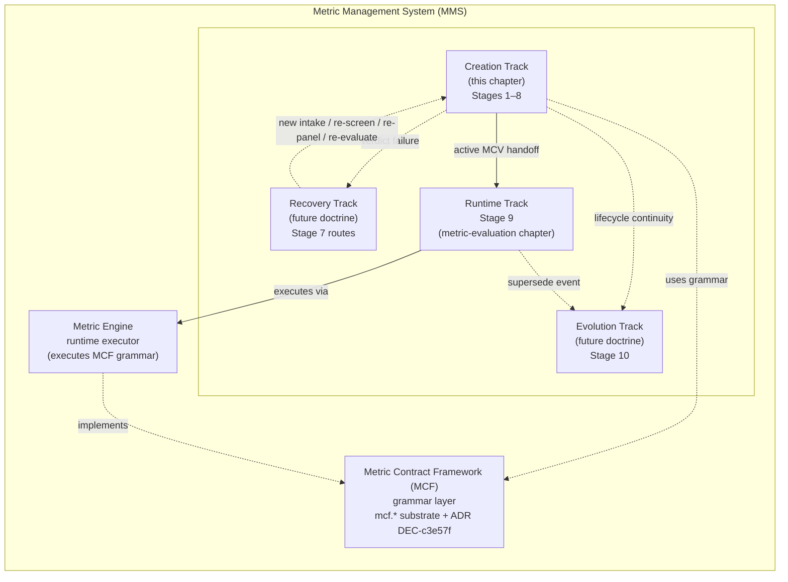
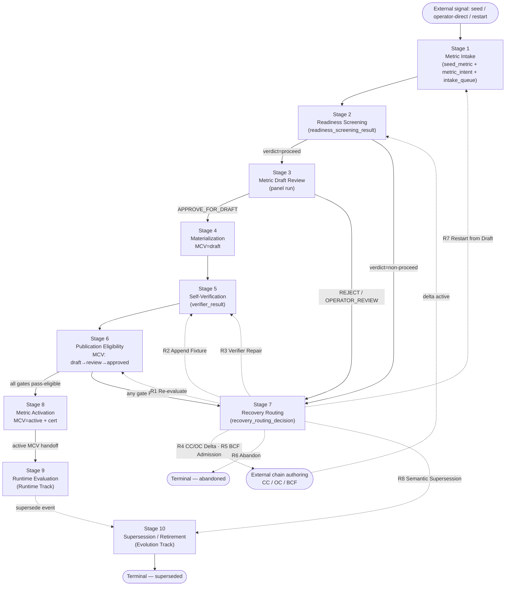

# Metric Management System

## 1. Purpose and posture

This chapter defines the **Metric Management System (MMS)** — the platform's endgame product / system boundary for the full lifecycle of a metric. MMS owns creation, activation, runtime evaluation, recovery from stuck states, evolution (supersession / retirement), and catalog visibility. This document is **flow / control first, naming second**. Naming is the language layer over the flow; it is not the flow itself.

The substantive content of this chapter is the **Creation Track** — the metric authoring path from operator intent (Stage 1) through publication eligibility to a live, certified Metric Contract Version (Stage 8). The chapter also defines two **cross-track touchpoints** — Stage 9 (Runtime Evaluation, owned by the Runtime Track) and Stage 10 (Metric Supersession / Retirement, owned by the Evolution Track) — because the Creation Track must define the handoff boundaries at activation and at supersession entry. The full Runtime Track and Evolution Track doctrines are future artifacts. The Recovery Track doctrine (artifact 1 in the §10 sequence) is the immediate next document.

The doctrine is operator-ratified as **draft-authoritative** in the readiness baseline. "Draft-authoritative" means: no ADR is filed for this doctrine, no code or substrate has been mutated to reflect the doctrine, but the doctrine is the binding input to the next round of MMS design and refactor work. Specifically, the doctrine is binding on the Recovery Track child doctrine, the Vocabulary-Lock ADR, and the Controlled Semantic Refactor described in the [Audit §7A](../evidence/audits/implementation/mcf-framework-audit-2026-06-22.md). It is not binding on the readiness-baseline substrate — that substrate is an interim state, not a counter-example to the doctrine. Where the existing substrate diverges from the doctrine, the divergence is recorded as a refactor implication (§7), not as a contradiction in the doctrine.

The five pre-doctrine decisions in [pre-doctrine-decisions](../evidence/work-records/implementation/mcf-final-operating-flow-pre-doctrine-decisions-2026-06-22.md) are the load-bearing inputs. The three open questions the prior draft surfaced (PE-MC-1 destination, PE-MC-8 resolution, Readiness Screening substrate shape) are operator-ratified and recorded in §8. Every section below reflects all five decisions and all three ratifications; if a section appears to contradict them, the section is wrong and the decision stands.

## 1A. Metric Management System hierarchy

This section names the umbrella system this chapter sits inside, and the tracks that compose it. The hierarchy is **doctrinal** — it organises how subsequent documents are scoped, owned, and read. It does NOT rename substrate or code identifiers; MCF schema (`mcf.*`), the MCF foundational ADR ([DEC-c3e57f / D422](../governance/adrs/ADR-c3e57f.md)), and MCF code surfaces (`bc-core/src/registry/mcf/`) keep their established names. The hierarchy lifts above MCF; it does not replace it.

### 1A.1 The umbrella system — Metric Management System (MMS)

**Metric Management System (MMS)** is the endgame product / system boundary. It owns the full lifecycle of a metric in the BareCount platform — creation, activation, runtime evaluation, recovery from stuck states, evolution (supersession / retirement), and catalog visibility. MMS is the artifact a future operator console surfaces, the artifact tenant-runtime concerns interact with, and the artifact that subsequent design work composes against.

### 1A.2 The grammar layer — Metric Contract Framework (MCF)

**Metric Contract Framework (MCF)** is the formal grammar for valid metric contracts. It defines what a Metric Contract *is* — the identity tuple, the formula AST, the variable-binding shape, the filter-clause shape, the temporal-gate grammar, the package signature, the immutability rules, the cert grammar. MCF is the substrate-and-grammar authority. It is not the operating flow; it is the alphabet the operating flow is written in. MCF is governed by [ADR DEC-c3e57f / D422](../governance/adrs/ADR-c3e57f.md) and lives in `bc-core/src/database/schema/mcf/` + `bc-core/docker/redesign/04..19-mcf-*.sql`.

### 1A.3 The runtime executor — Metric Engine

**Metric Engine** is the runtime executor that applies an active Metric Contract Version against tenant data to produce Metric Snapshots. The Metric Engine is owned by the Runtime Track (§1A.4); it implements the MCF grammar at execution time. The current platform's runtime evaluator is named in [metric-evaluation](metric-evaluation.md); the Metric Engine doctrine name is the term this chapter uses for the executor role across the four tracks.

### 1A.4 The four tracks of MMS

MMS organises its operational doctrine into four tracks. Each track is a peer; each will eventually have its own operating doctrine document.

| Track | Scope | Owning doctrine |
|---|---|---|
| **Creation Track** | Intent → activation. The metric authoring path from operator intent through publication eligibility to a live, certified Metric Contract Version. | **This chapter** — `metric-management-system.md` (current substantive content; future MMS overview content may layer above as siblings ship). |
| **Runtime Track** | Tenant-runtime evaluation of active Metric Contract Versions via the Metric Engine. Tenant-data resolution, snapshot emission, runtime-readiness checks. | Future. Stage 9 in this chapter is a cross-track touchpoint (Creation → Runtime handoff). [metric-evaluation](metric-evaluation.md) is the current runtime chapter and is the Runtime Track's nucleus. |
| **Recovery Track** | Routing and operational policy for metrics stuck in publication review with REJECT verdicts, or screened out at Readiness Screening, or rejected at panel. | Future child doctrine — `metric-management-system-recovery-track.md` (pending). Stage 7 (Recovery Routing) in this chapter names the eight canonical routes; the Recovery Track doctrine fills in the per-route operational policy. |
| **Evolution Track** | Supersession, retirement, rebind on active metrics. | Future. Stage 10 in this chapter is a cross-track touchpoint (Creation → Evolution lifecycle continuity). |

### 1A.5 What this chapter is and isn't

**This chapter specifies the Creation Track** in full, plus Stages 9 and 10 as **cross-track touchpoints** — included because:

- Creation Track must define the **handoff boundary** to Runtime Track at Stage 8 → Stage 9 (what state the active MCV is in when runtime takes over, what evidence has been emitted, what guarantees the Metric Engine can assume).
- Creation Track must preserve **lifecycle continuity** into Evolution Track at Stage 10 (an activated Metric Contract Version must be cleanly succeedable; the cert grammar that supports supersession must be coherent with the Creation Track's cert discipline).

The operating rules for Runtime Evaluation and for Supersession / Retirement themselves are owned by the future Runtime Track and Evolution Track doctrines; this chapter carries only the cross-track handoff doctrine for those stages, not the full track doctrine.

### 1A.6 Architectural diagram — MMS endgame track architecture

The diagram below names the umbrella system, its four tracks, the grammar layer (MCF), and the runtime executor (Metric Engine). Solid arrows denote in-track flow; dotted arrows denote cross-track handoffs.



*Diagram DG-mms-track-architecture.*

## 2. Authority and inputs

| Input | Role |
|---|---|
| [Pre-doctrine decisions note](../evidence/work-records/implementation/mcf-final-operating-flow-pre-doctrine-decisions-2026-06-22.md) | Five locked draft decisions on Readiness Screening as gate, Metric Intent as first-class artifact, two-layer duplicate-intent, exhaustive PE-MC-N mapping, Recovery Track as parallel doctrine. |
| [Audit findings](../evidence/audits/implementation/mcf-framework-audit-2026-06-22.md) | Evidence base — recorded implementation gaps and why the doctrine is needed. Section §6 gap inventory and §7A controlled-refactor staging are referenced throughout. |
| [The Invariants](../foundation/the-invariants.md) | Foundation invariants. Particularly Invariant III (append-only ledger) and Invariant V (non-replayable evaluation). The doctrine respects both — no historical evidence is rewritten; every evaluation emits its evidence row. |
| [The Contract Grammar](../foundation/the-contract-grammar.md) | Authority for what a Metric Contract is. MCF is the substrate-and-grammar implementation of that authority for the metric family. |
| [The Evaluation Boundaries](../foundation/the-evaluation-boundaries.md) | Stage 9 (Runtime Evaluation) defers to this authority for the runtime boundary's rules. |
| [ADR DEC-c3e57f / D422](../governance/adrs/ADR-c3e57f.md) | The MCF foundational ADR. The doctrine refines but does not contradict its build-plan scope. Decision 2 establishes identity-bearing fields on `mcf.metric_contract`; Decision 7 establishes MCV as descriptive-only. |
| [ADR DEC-69f09e / D148](../governance/adrs/ADR-69f09e.md) | Substrate naming rules — `snake_case`, etc. The doctrine's semantic names follow these rules where they touch persisted surfaces. |
| Substrate sources | `bc-core/src/database/schema/mcf/` (24 Drizzle schema files) + `bc-core/docker/redesign/04..19-mcf-*.sql` (19 DDL files). The doctrine cites specific schema and DDL sources where load-bearing in §3 and §4. |

## 3. The Flow — stage map

The doctrine defines **ten stages**, in order. Each stage has one owning surface, one canonical input set, one canonical output set, and one set of allowed state transitions on the substrate it touches. A metric proceeds through the stages monotonically; Recovery Routing (Stage 7) is the only branch back into the flow, and it is itself a stage.

### 3.0 Creation Track state machine



*Diagram DG-mms-creation-track-state-machine.*

The remaining sub-sections of §3 define each stage's inputs, outputs, owning surface, and allowed state transitions.

### 3.1 Stage 1 — Metric Intake

**Purpose.** Admit a metric request into the framework and capture two artifacts: the seed entry (machine-readable record) and the **Metric Intent** (operator's reading of what the metric is intended to measure).

**Inputs.**

- External signal — a seed catalog import, an operator-direct authoring request, or a previously-abandoned metric being restarted (Recovery Routing R7).
- Operator-authored **Metric Intent** (per Pre-Doctrine Decision 2) with at minimum: intent statement, target grain expectation, formula-shape expectation, temporal start/end anchors (when applicable), exclusions / non-goals, ambiguity notes, operator-approved interpretation when ambiguity exists.

**Outputs.**

- One `mcf.seed_metric` row (or equivalent intake row when the request bypasses the seed catalog). The `mcf.seed_metric` row carries `candidate_source_ref_json.source_type` from the closed enum `{seed_metrics, metric_definition, operator_direct, legacy_metric_contract, other}` (per `bc-core/src/database/schema/mcf/metric-contract.ts` `mc_candidate_source_type_chk` line 53–56).
- One `mcf.metric_intent` row (new substrate — see §7.1 refactor implications).
- One `mcf.metric_authoring_intake_queue` row in `status_code = 'pending'`, linking the seed and the Intent.

**Owning surface.** Existing `mcf-intake.controller.ts` + `ReservoirIngestionService`, extended with intent-authoring endpoint(s); new `MetricIntentService` (proposed). Authoring is operator-facing — Metric Intent is never authored by the Maker / Checker / Moderator panel.

**Allowed state transitions.** Intake produces fresh rows; no transition on existing substrate. The intake-queue row enters at `pending` and is read by Stage 2.

**Failure modes.** Intake fails only on validation — required Intent fields missing, seed catalog row malformed, grain entity unknown. Intake never fails on substrate coverage; coverage is Stage 2's question.

### 3.2 Stage 2 — Readiness Screening

**Purpose.** Classify the intake before any Maker call. Determine whether the substrate is ready for the panel to run productively.

**Inputs.**

- One `mcf.metric_authoring_intake_queue` row in `status_code = 'pending'`.
- The linked `mcf.metric_intent` row.
- A read-only snapshot of: active Business Concept inventory (per the candidate's target grain), active Canonical Contract / Observation Contract / Source Contract / Admission Contract chains on that grain, active Metric Contract identity catalog (for early duplicate-intent matching), verifier-portfolio shape coverage inventory.

**Outputs.** One persisted `mcf.readiness_screening_result` row (new substrate — see §7.1) carrying a closed-enum verdict from the set defined in Pre-Doctrine Decision 1:

```
proceed                       — substrate covers all needs; Stage 3 may run
needs_bcf                     — required Business Concepts not in active BCF
needs_cc_oc                   — BCs present but not declared by active Canonical / Observation Contract
needs_verifier                — formula-shape expectation outside the verifier portfolio
duplicate_intent              — lossy match against active MC or in-flight candidate
needs_intent_clarification    — Metric Intent has unresolved ambiguity blocking screening
```

**Owning surface.** New `ReadinessScreeningService` + `readiness-screening.controller.ts` (proposed). Reads from BCF / Contract / Verifier-portfolio surfaces; writes to `mcf.readiness_screening_result`; never mutates business substrate (planner-only, mirroring the `chain-enrichment.service.ts` discipline established under [DEC-739e23 / D446](../governance/adrs/ADR-739e23.md)).

**Allowed state transitions.**

- Intake-queue row stays in `pending` after screening; transition to `consumed_by_panel` is owned by Stage 4 (per existing M11/M12 discipline, preserved).
- Screening produces an immutable result row per Foundation Invariant III; a re-screen produces a new row with a `prior_result_uid` back-reference, never an UPDATE.

**Gating behavior.** Stage 3 cannot be invoked unless the gate-read `readiness_screening_result` for the intake row has `verdict_code = 'proceed'`. The single permitted bypass is an explicit operator override — a separate persisted row (`mcf.readiness_screening_override` or equivalent) with rationale ≥ 40 chars, captured before Stage 3 is invoked. Every override is recorded; the framework never silently bypasses screening.

**Failure modes.** Any non-`proceed` verdict routes the intake into the **early entry of Recovery Routing (Stage 7)** with the verdict as the routing key. Stage 7 selects the appropriate recovery route per §5.

### 3.3 Stage 3 — Metric Draft Review

**Purpose.** Panel proposes a metric candidate consistent with the Metric Intent and the substrate Readiness Screening has confirmed.

**Inputs.**

- `mcf.metric_authoring_intake_queue` row.
- `mcf.metric_intent` row (Maker prompt receives Intent verbatim; Checker / Moderator validate Maker output against Intent).
- Gate-read `mcf.readiness_screening_result` with `verdict_code = 'proceed'` (or a recorded override).
- Snapshot of allowed tool surface (workspace tool allowlist + evidence source allowlist).

**Outputs.**

- One `contract.panel_output_record` row (BCF-shared) and one `mcf.metric_authoring_panel_run` row.
- Three `mcf.metric_authoring_panel_transcript` rows (maker, checker, moderator).
- A `consensus_payload_json.verdict_code` of `APPROVE_FOR_DRAFT` / `OPERATOR_REVIEW` / `REJECT_DEFECT`.

**Owning surface.** Existing `MetricAuthoringPanelService` + `mcf-panel-run.controller.ts`. The structured-output failure handling already in `metric-authoring-panel.service.ts:528–549` and `panel-envelope-finalization.ts:91–119` is preserved; the doctrine adds the verdict-grammar refinement from [Audit §6.7](../evidence/audits/implementation/mcf-framework-audit-2026-06-22.md) — introduce a defect_code distinct from substantive `OPERATOR_REVIEW` so consumers can route differently.

**Allowed state transitions.** Panel writes new substrate rows; the intake-queue row stays in `pending` (Stage 4 transitions it). The MCV / MC rows do not exist yet — Stage 3 produces only the panel evidence.

**Failure modes.** `REJECT_DEFECT` routes back to Recovery Routing (Stage 7). `OPERATOR_REVIEW` with substantive defect routes to Recovery. `OPERATOR_REVIEW` with structured-output failure (per the §6.7 refinement) routes to Recovery with a route-specific tag instructing re-panel rather than re-design.

### 3.4 Stage 4 — Metric Contract Materialization

**Purpose.** Convert an `APPROVE_FOR_DRAFT` panel proposal into draft substrate — Metric Contract + Metric Contract Version + variable bindings + filter clauses + computed-dimension references + first proposed fixture + initial Self-Verification result.

**Inputs.**

- `mcf.metric_authoring_panel_run` row with `consensus_payload_json.verdict_code = 'APPROVE_FOR_DRAFT'`.
- The harvested `candidate_proposal_json` from the panel run.

**Outputs.** Per the MCF substrate as defined in `metric-contract.ts` and `metric-contract-version.ts` (DDL: `04-mcf-substrate.sql` and `07-mcf-formula-ast-storage.sql`):

- **One `mcf.metric_contract` row** — the parent MC is the identity-bearing root. Per the schema comment in `metric-contract-version.ts` lines 7–9: "identity-bearing fields (formula, bindings, grain, filters, temporal gate) live on the parent `mcf.metric_contract` row. Versions exist for descriptive revisions only." Columns populated here:
  - `mc_name`, `display_name`, `grain_entity_id`.
  - `temporal_gate_shape_code` (closed enum from the substrate CHECK: `instantaneous`, `trailing_window`, `period_aggregate`, `point_in_time`, `as_of`, `rolling_window` — per `mc_temporal_gate_shape_chk` in `metric-contract.ts` line 49–52) and `temporal_gate_params_json`.
  - `candidate_source_ref_json`.
  - The six identity-hash columns (`formula_intent_hash`, `variable_binding_set_hash`, `filter_set_hash`, `identity_tuple_hash`, `package_signature_hash`, `hash_algorithm_version`) left NULL until Stage 6 stamping (per `metric-contract.ts` line 33: "Hash columns are NULLABLE in M2; M3 lifecycle enforcement adds NOT NULL once `governance_state_code` reaches `approved`").
  - `archived_at = NULL`.
  - **The MC row carries no `governance_state_code`** — state lives on MCV.
- **One `mcf.metric_contract_version` row** at `governance_state_code = 'draft'`, `is_current = FALSE`, with `formula_ast_canonical_json` populated from the panel proposal (per `metric-contract-version.ts` line 44).
- **One or more `mcf.metric_variable_binding` rows**, FK'd to the MCV; identity-bearing (the row content participates in the parent MC's `variable_binding_set_hash`).
- **Zero or more `mcf.metric_filter_clause` rows**, FK'd to the MCV; identity-bearing (participate in `filter_set_hash`).
- **Zero or more `mcf.metric_computed_dimension_ref` rows**, FK'd to the MCV; identity-bearing.
- **One `mcf.metric_self_verification_fixture` row** (panel-attested).
- **One `mcf.metric_self_verification_result` row** from the initial Self-Verification (Stage 5 runs inline as part of Stage 4 materialization per the existing M12.5 contract).
- **One `mcf.certification_record` row** with `action_code = 'metric_create'`, `from_state_code = NULL`, `to_state_code = 'draft'`.
- **One `mcf.metric_authoring_intake_queue` row state transition**: `pending → consumed_by_panel`.

**Owning surface.** Existing `MetricAuthoringMaterializationService` + `mcf-materialization.controller.ts` (generic, per [Audit §6.1](../evidence/audits/implementation/mcf-framework-audit-2026-06-22.md) source-verified). Per-metric controllers (`mcf-arpi-materialization.controller.ts`, `billing-volume-retry-unlock/`) are historical quarantine candidates (per Audit §7A.3 step 6).

**Allowed state transitions.** Per substrate triggers in `05-mcf-lifecycle-substrate.sql` and `07-mcf-formula-ast-storage.sql`:

- `fn_mcv_state_transition_check` (M3) prevents any MCV `governance_state_code` other than `draft` at insert.
- `fn_mcv_descriptive_immutability_check` (M3, extended by M7/M8) prevents `formula_ast_canonical_json` mutation at non-draft MCV state, and prevents descriptive MCV column mutation at any non-draft state.
- `fn_mc_active_immutability_check` (M3) prevents MC identity-bearing column mutation when an active MCV exists under the same MC.
- The parent MC row carries no state column — only `archived_at` transitions (NULL → timestamp on abandon via `mcf-mcv-abandon.controller.ts`).

**Failure modes.** Materialization preconditions (`L-V1*` family — shape-code validity, formula AST grammar, prior-materialization absence, collision avoidance) are read-only checks before any write; precondition failure throws `MaterializationPreconditionError` and produces no substrate change. The panel run remains valid for retry.

### 3.5 Stage 5 — Self-Verification

**Purpose.** Run the candidate metric's formula against its seed fixture and emit the verifier evidence row.

**Inputs.**

- `mcf.metric_contract_version` row in `governance_state_code = 'draft'`.
- `mcf.metric_self_verification_fixture` row authored at Stage 4.

**Outputs.** One `mcf.metric_self_verification_result` row carrying `verdict_code = 'pass' | 'fail' | 'structural_reject'`, `stale_fixture_flag`, and the algorithmic hashes (`bound_package_signature_hash_at_run`, `fixture_bound_package_signature_hash`) per `10-mcf-self-verification-result.sql`.

**Owning surface.** Existing `MetricSelfVerificationService` + `FormulaExecutionEngine` + `ResolverFixtureConfigInterpreter` + `OutputComparator`. The verifier-portfolio extension ([Audit §6.4](../evidence/audits/implementation/mcf-framework-audit-2026-06-22.md)) is a per-shape regression suite that runs *outside* this stage but blocks engine version bumps; the doctrine's flow does not change at this point as the portfolio matures.

**Allowed state transitions.** Self-Verification writes a result row; the MCV state does not advance — that is Stage 6's job. The result is an input to G5 (Self-Verification Gate) in Stage 6.

**Failure modes.** `verdict_code = 'fail'` produces a row that Stage 6 reads; the failure is surfaced through Publication Eligibility, not at this stage. `verdict_code = 'structural_reject'` carries one of the `C-FX-*` defect codes emitted by `FixtureStructuralCheckService.runStructuralChecks`; the recovery route depends on the defect code, not on the verdict alone — fixture-shape defects route to **Append Fixture (R2)**; engine-capability defects route to **Verifier Repair (R3)**. The per-defect-code routing table belongs in the Recovery Track doctrine; this Creation Track doctrine establishes that the routing is defect-code-keyed, not verdict-keyed.

### 3.6 Stage 6 — Publication Eligibility Evaluation

**Purpose.** Run the full publication-eligibility gate matrix against a Metric Contract Version. On first run, advance MCV `governance_state_code` `draft → review` and, on all-pass aggregation, advance further to `approved` and stamp parent Metric Contract hash columns. On a re-run from `review` after a substrate change (e.g. a Canonical Contract delta has landed, a fresh fixture has been appended, an engine version has shipped), re-evaluate against the invocation-time substrate; on all-pass, advance `review → approved` and stamp hashes; on continued partial-pass, the MCV stays at `review` and a fresh set of `mcf.metric_publication_eligibility_result` rows is appended (Foundation Invariant V — every evaluation emits its evidence).

**Inputs.**

- `mcf.metric_contract_version` row in `governance_state_code = 'draft'` (first evaluation) **or** `'review'` (re-evaluation after substrate change). Re-evaluation from `review` is a first-class flow; the IPCT supplier-grain activation (live ledger evidence) traversed exactly this path — a first M13 evaluation rejected on Source-Chain Resolvability, a new Canonical Contract chain landed, a second M13 evaluation passed all gates, and Stage 8 activated the MCV. The append-fixture controller similarly accepts `draft` or `review` MCVs (per `mcf-mcv-fixture-append.controller.ts:8`).
- All Stage 4 outputs (bindings, filters, computed dims).
- Gate-read `mcf.metric_self_verification_result` row for this MCV (Stage 6 reads the gate-read fixture+result per the append-fixture surface's design — see R2 in §5.1).
- Read-only snapshot of substrate authority (active Canonical Contract on the candidate's grain, BCF Business Concept inventory, M8 PackageSignatureService for the canonical identity tuple).

**Outputs.** One `mcf.metric_publication_eligibility_result` row per gate check (substrate is append-only per Invariant V); MCV state advances per the aggregation rule (§4.5); parent MC hash columns stamped if state reaches `approved`.

**Owning surface.** Existing `MetricPublicationEligibilityEvaluatorService` + `mcf-publication-eligibility.controller.ts`. The evaluator is one of the surfaces that the staged refactor (§7) renames; the doctrine uses its semantic name.

**Allowed state transitions.**

- `draft → review` always emitted when at least one gate runs (the evaluator opens the MCV's transition window).
- `review → approved` only when the aggregation rule (§4.5) returns approve-eligible.
- Hash columns on parent MC stamped on `review → approved` per M3 substrate trigger.
- No transition to `active` — that is Stage 8.

**Failure modes.** Per-gate REJECT or non-pass-eligible OPERATOR_REVIEW lands the MCV at `review` state with REJECT evidence. The verdict ledger is the Stage 7 input.

### 3.7 Stage 7 — Recovery Routing

**Purpose.** Read the verdict ledger of a stuck Metric Contract Version (or a non-`proceed` Readiness Screening result, or a `REJECT_DEFECT` panel run) and route the candidate to one of the eight canonical recovery routes defined in §5. Persist the operator's chosen route as auditable evidence.

**Inputs.**

- The stuck artifact: `mcf.readiness_screening_result` with non-`proceed` verdict, OR `mcf.metric_authoring_panel_run` with `REJECT_DEFECT` or substantive `OPERATOR_REVIEW`, OR `mcf.metric_contract_version` in `governance_state_code = 'review'` with REJECT verdicts on `mcf.metric_publication_eligibility_result`.
- The verdict evidence — the predicate(s) that rejected, the gate(s) involved.
- Operator decision (when multiple routes apply or when the route requires operator-only authority).

**Outputs.** One `mcf.recovery_routing_decision` row (new substrate — see §7.1) carrying the input artifact reference, the chosen route, the operator rationale, and an FK to the artifact the route produces (e.g. a new `chain_enrichment_plan` row when the route is "CC/OC delta"; a new intake-queue row when the route is "restart-from-draft").

**Owning surface.** New `RecoveryOrchestrationService` + `recovery-routing.controller.ts` (proposed). Reads from the verdict ledger; writes routing decisions; dispatches to the surfaces that own each route (existing rebind, abandon, supersede, fixture-append controllers; the proposed Chain Enrichment v1 surface; the panel via re-intake).

**Allowed state transitions.** Recovery does not mutate the stuck artifact itself (the immutable ledger holds). Recovery emits a new artifact (a new intake-queue row, a new chain-enrichment plan, a new MC archival) that the operator's chosen route consumes. Per Foundation Invariant III, the stuck MCV row is preserved as historical evidence even when its parent MC is soft-archived.

**Failure modes.** Recovery's own failure modes are operator-decision failures (route not applicable, rationale insufficient, override required but not provided). The Recovery Track doctrine (`metric-management-system-recovery-track.md`, pending) fills in the per-route operational policy.

### 3.8 Stage 8 — Metric Activation

**Purpose.** Transition an approved Metric Contract Version to `active` and issue the activation certification record.

**Inputs.**

- `mcf.metric_contract_version` row in `governance_state_code = 'approved'`, with parent MC hash columns stamped.
- The `mcf.metric_publication_eligibility_result` rows that constitute the approve-eligibility evidence.

**Outputs.**

- MCV `governance_state_code` transition `approved → active`.
- `is_current = TRUE` flip with prior-active-MCV demotion (when a prior version exists; per existing M3 + M14 cert-writer logic).
- One `mcf.certification_record` row with `action_code = 'metric_transition'`, `from_state_code = 'approved'`, `to_state_code = 'active'`.
- One activation-time set of `mcf.metric_publication_eligibility_result` rows under the M14 activation evaluator version (e.g. `mcf-m14-v2` in the current live ledger), each linked to the activation cert. These are activation-evidence rows that record the gate state at the activation moment; they are not a re-evaluation against fresh substrate. The M13 pre-approve PE rows (under `mcf-m13-v*`) remain in the ledger with `certification_record_id = NULL`, preserved per Foundation Invariant V. The doctrine does not redesign this two-ledger pattern — it documents it as the steady-state shape.

**Owning surface.** Existing `mcf-publication-activation.controller.ts` invoking `McfCertWriterService.activateMetric` (and `submitForReviewInTx` / `approveForActivationInTx` via the same-tx wiring contract from M13 PR #130).

**Allowed state transitions.** M3 substrate trigger enforces that activation requires a `metric_transition` cert. The cert and the state transition commit atomically. M3 immutability triggers prevent post-activation descriptive mutation; only state transitions (active → superseded via Stage 10) are permitted thereafter.

**Failure modes.** Activation pre-conditions are substrate-trigger-enforced. A failed activation produces no state change.

### 3.9 Stage 9 — Runtime Evaluation

**Cross-track touchpoint.** Stage 9 is owned by the **Runtime Track** of MMS (see §1A.4). It appears in this Creation Track chapter because Stage 8 → Stage 9 is the handoff boundary from authoring to runtime, and that boundary is itself Creation Track doctrine — the receiver of an activated Metric Contract Version must know what the Creation Track guarantees, and the Creation Track must know what the **Metric Engine** expects. The operating rules for Runtime Evaluation itself (how tenant data is resolved through the chain, how snapshots are emitted, how runtime-readiness is checked at the tenant level — including the runtime-readiness predicate that legacy PE-MC-8 carried and that §4.4 retired from publication gating) are owned by the future Runtime Track doctrine. The current platform Metric Evaluator is documented in [metric-evaluation](metric-evaluation.md); this chapter specifies only the handoff.

**Purpose.** Run the active metric against tenant data on the tenant runtime path via the Metric Engine.

**Inputs.**

- Active Metric Contract Version (post-Stage 8).
- Tenant data on the appropriate grain (sourced through the active Source Contract / Admission Contract / Observation Contract / Canonical Contract chain).

**Outputs.** Tenant metric snapshots (tenant-runtime substrate, not platform MCF substrate). See [metric-evaluation](metric-evaluation.md) for the snapshot grammar and the Metric Evaluator's behavior.

**Owning surface.** Metric Engine (Runtime Track; see [metric-evaluation](metric-evaluation.md)).

**Allowed state transitions.** Runtime Evaluation never mutates the active Metric Contract Version. Per Foundation invariants, evaluation is non-replayable; evidence is emitted to the tenant-runtime ledger.

**Doctrine rule.** Tenant data absence does not block authoring publication. If a Metric Contract Version is published with no tenant data available to evaluate, the metric remains active and waits for data. Authoring publication requires only that the contract chain be source-resolvable, not that tenant data exist; the verifier in Stage 5 runs against a synthetic fixture, not against tenant data. This rule is the Creation Track's half of the handoff with Runtime Track.

### 3.10 Stage 10 — Metric Supersession / Retirement

**Cross-track touchpoint.** Stage 10 is owned by the **Evolution Track** of MMS (see §1A.4). It appears in this Creation Track chapter because supersession lifecycle continuity must be preserved at the activation boundary — an activated Metric Contract Version must be cleanly succeedable, and the cert grammar that supports supersession (`metric_supersede` action_code; the `mcs_different_mc_chk` substrate CHECK; the `mcf.metric_supersession` link table per `05-mcf-lifecycle-substrate.sql`) must be coherent with the Creation Track's cert discipline at Stages 4 and 8. The operating rules for Evolution itself are owned by the future Evolution Track doctrine; this chapter specifies only the lifecycle-continuity boundary.

**Purpose.** Transition an active Metric Contract Version to superseded (with a replacement Metric Contract Version) or retired (archived with no replacement).

**Inputs.**

- Active `mcf.metric_contract_version` row.
- For supersession: the replacement Metric Contract Version (already-active or being-activated in the same transaction).
- For retirement: operator rationale and a retirement category (semantic-obsolescence, source-deprecation, business-decision).

**Outputs.**

- MCV `governance_state_code` transition `active → superseded`.
- One `mcf.metric_supersession` row linking predecessor + successor (supersession path).
- One `mcf.certification_record` row with `action_code = 'metric_supersede'`.
- Parent MC `archived_at` stamped (for retirement path with no replacement).

**Owning surface.** Existing `mcf-mcv-supersede.controller.ts` + `McfCertWriterService`. The doctrine notes a future refinement ([Audit §7A.3 step 6](../evidence/audits/implementation/mcf-framework-audit-2026-06-22.md)) to align this surface's route naming with the semantic-name convention.

**Allowed state transitions.** Substrate-trigger-enforced. Supersession requires a `metric_supersede` cert and a different successor MC UID per the M3 `mcs_different_mc_chk` CHECK.

**Failure modes.** Substrate-side; the cert + state transition commit atomically.

## 4. Gate inventory and exhaustive PE-MC-N mapping

### 4.1 The nine semantic gates

Publication Eligibility Evaluation (Stage 6) runs **nine semantic gates** (G1–G9 per the §8.1 PE-MC-1 → G9 ratification). The doctrine names eight of them in the table below; the ninth — G9 Provenance Grounding Gate — is defined in §4.2 because it answers an authority question distinct from the other eight. The per-legacy-gate mapping is in §4.3. Each gate has a fixed predicate, a fixed input set, and a fixed PASS / REJECT / OPERATOR_REVIEW grammar.

| # | Semantic gate | What it tests |
|---|---|---|
| G1 | Identity Uniqueness Gate | The candidate's `mc_name` is unique within the active (non-archived) Metric Contract set; the partial unique index `idx_mcf_mc_mc_name_active` is the substrate-side enforcement, and the gate surfaces violations into the verdict ledger. |
| G2 | Binding Integrity Gate | Every formula variable role has a corresponding binding row; every binding's Business Concept is grain-reachable; type / unit / representation-term snapshots align with body declaration; computed-dimension role references resolve in the AST. **Absorbs legacy PE-MC-2, PE-MC-3, PE-MC-4, PE-MC-7.** |
| G3 | Source-Chain Resolvability Gate | Every variable binding's Business Concept is declared by the resolved Canonical Contract's `field_selection` and reachable through the Source / Admission / Observation Contract chain. **Renames legacy PE-MC-11.** |
| G4 | Source-Vocabulary Discipline Gate | Variable bindings stay within source vocabulary — no derived or synthesized fields posing as source-grade. **Renames legacy PE-MC-12.** |
| G5 | Self-Verification Gate | The gate-read `mcf.metric_self_verification_result` for the candidate has `verdict_code = 'pass'`, `stale_fixture_flag = false`, and the bound package signature matches the M13-computed package signature in force. **Renames legacy PE-MC-10; absorbs the fixture-presence sub-check formerly at PE-MC-5.** |
| G6 | Package Signature Currency Gate | The package signature used to evaluate the candidate is current with respect to substrate at evaluation time — no upstream Business Concept supersession, Canonical Contract version advance, or Observation Contract change has staled the package since the fixture was bound. **New gate, lifted out of the stale-fixture-flag check inside PE-MC-10.** |
| G7 | Lifecycle Authority Gate | The candidate's lifecycle transitions to date have been governed by the correct cert grammar (`metric_create` at draft, `metric_transition` at activation, `metric_supersede` at supersession). **New gate, lifts substrate-trigger enforcement into the verdict ledger.** |
| G8 | Duplicate Intent Gate | The candidate's canonical `identity_tuple_hash` does not collide with any non-archived Metric Contract's identity tuple. **Renames legacy PE-MC-9. Late-layer of the two-layer duplicate-intent discipline (Pre-Doctrine Decision 3); the early-layer fingerprint check runs in Stage 2.** |

### 4.2 Provenance Grounding — ratified as G9

**Operator decision (ratified).** Legacy PE-MC-1 (Provenance Grounding Gate — checks the panel's BCF citation chain is grounded against the active concept registry) is **promoted to G9 — Provenance Grounding Gate** as its own ninth gate. Grounding is its own authority question; it does not merge into Source-Chain Resolvability or any other gate.

The doctrine's full semantic gate set is **G1–G9 (nine gates)**. Predicate is preserved from PE-MC-1; the writer side emits `pe_check_code = 'G9'` (or the doctrine's eventual database-enum value) going forward; the reader side accepts both `G9` and legacy `PE-MC-1` per Invariant III.

The two predicates that this ratification keeps separate:

- **G3 — Source-Chain Resolvability Gate.** Reads outward — given a variable binding's Business Concept, is it declared by the active Canonical Contract's `field_selection` and reachable through the Source / Admission / Observation Contract chain?
- **G9 — Provenance Grounding Gate.** Reads inward — given the panel's evidence chain, is each cited Business Concept / characteristic / entity / source field grounded against the active concept registry, or did the Maker / Checker cite a substrate row that does not exist or has been superseded?

The two gates fail for different reasons and route to different recovery actions. Merging them would conflate a chain-coverage failure (recovery via Chain Enrichment v1 — R4) with a citation-validity failure (recovery via re-panel with corrected evidence — re-enter Stage 3 with refined intake).

### 4.3 Exhaustive legacy `PE-MC-N` mapping table

Per Pre-Doctrine Decision 4. Every legacy gate's destination is named.

| Legacy gate | Destination | Rationale |
|---|---|---|
| PE-MC-1 (Provenance grounding) | **G9 — Provenance Grounding Gate** (ratified per §8.1; see §4.2 for the predicate distinction from G3) | Distinct predicate; distinct failure recovery; warrants own gate. |
| PE-MC-2 (Grain coherence) | **G2 — Binding Integrity Gate** (merge) | Grain reachability is a property of every binding; absorbed into the binding-integrity predicate set. |
| PE-MC-3 (Binding completeness) | **G2 — Binding Integrity Gate** (merge) | Same family. |
| PE-MC-4 (Type + unit coherence) | **G2 — Binding Integrity Gate** (merge) | Same family. |
| PE-MC-5 (Self-verification fixture presence) | **G5 — Self-Verification Gate** (absorbed as sub-check) | Fixture presence is a precondition of pass; absorbed rather than separated. |
| PE-MC-6 (Temporal-gate shape) | **G2 — Binding Integrity Gate** (merge) | Temporal gate shape is part of the binding identity (substrate enum on `mcf.metric_contract.temporal_gate_shape_code` per §6.6); absorbed. The OPERATOR_REVIEW branch of PE-MC-6 is preserved inside G2 as a sub-verdict. |
| PE-MC-7 (Computed-dimension coherence) | **G2 — Binding Integrity Gate** (merge) | Computed-dimension reachability is part of binding integrity. |
| PE-MC-8 (Runtime readiness intent) | **Retired from publication; relocated to Stage 9 — see §4.4** | Authoring publication does not require runtime readiness. |
| PE-MC-9 (Duplicate-intent detection) | **G8 — Duplicate Intent Gate** (rename, semantically equivalent) | Predicate preserved exactly. |
| PE-MC-10 (Self-verification fixture pass) | **G5 — Self-Verification Gate** (rename + absorption of PE-MC-5) | Predicate preserved; absorbs the fixture-presence sub-check. |
| PE-MC-11 (Source-Chain Resolvability) | **G3 — Source-Chain Resolvability Gate** (rename, semantically equivalent) | Predicate preserved exactly. |
| PE-MC-12 (Source-Vocabulary Discipline) | **G4 — Source-Vocabulary Discipline Gate** (rename, semantically equivalent) | Predicate preserved exactly. |
| (new) | **G1 — Identity Uniqueness Gate** | Lifts substrate-side `idx_mcf_mc_mc_name_active` enforcement into the verdict ledger. New gate; no legacy predecessor. |
| (new, lifted) | **G6 — Package Signature Currency Gate** | Lifts the `stale_fixture_flag` sub-check out of legacy PE-MC-10 into its own gate so package-currency failures are routable distinctly from substantive verifier failures. |
| (new, lifted) | **G7 — Lifecycle Authority Gate** | Lifts substrate-trigger cert-presence enforcement into the verdict ledger so lifecycle defects produce explicit verdicts, not opaque trigger exceptions. |

### 4.4 PE-MC-8 — ratified as retired from publication gating

**Operator decision (ratified).** Legacy PE-MC-8 (Runtime-Readiness Intent) is **retired from Publication Eligibility Evaluation**. The runtime-readiness concern moves to **Stage 9 — Runtime Evaluation**, where it semantically belongs. Authoring publication proves the contract is valid; it does not require tenant / runtime readiness.

The doctrine's posture: Stage 6 emits no further rows for legacy gate `PE-MC-8` under the new evaluator versions. Legacy rows for `PE-MC-8` in `mcf.metric_publication_eligibility_result` remain in the ledger as historical evidence per Foundation Invariant III — never rewritten. The aggregation rule in §4.5 drops the legacy PE-MC-8 special case ("default-pass-pending-m18+") and reduces to the simpler all-of-G1..G9-pass-eligible rule.

The runtime-readiness predicate itself is not destroyed — it is **relocated**. Stage 9 (Runtime Evaluation) owns the runtime-readiness check on the tenant-runtime path via the Metric Engine. The mechanics of that check are out of this chapter's scope (tenant runtime is named in §3.9 but not specified here). The M18+ runtime-readiness ADR, when filed, attaches to Stage 9, not to Stage 6.

### 4.5 Aggregation rule

Stage 6 produces a single aggregate verdict from the per-gate results:

- **Approve-eligible** if every gate of G1–G9 is `PASS`, or `OPERATOR_REVIEW` with an explicitly approve-eligible sub-reason.
- **Review-only** if any gate is `REJECT`, or `OPERATOR_REVIEW` with a non-approve-eligible sub-reason.

The aggregation rule replaces the legacy `approve_eligible = all of PE-MC-{1,2,3,4,5,6,7,9,10} PASS AND PE-MC-8 ∈ {PASS, OPERATOR_REVIEW with default-pass-pending-m18+}` enumeration from `mcf-m13-implementation-closeout.md` §5. Per §4.4's PE-MC-8 retirement, the new rule drops the PE-MC-8 special case entirely; the rule is uniformly "every gate approve-eligible."

## 5. Recovery Routing — the eight canonical routes

Stage 7 reads the verdict evidence and routes the stuck candidate to one of eight canonical recovery routes. Each route has one owning surface and one defined output. The per-route operational policy lives in the **Recovery Track doctrine** (`metric-management-system-recovery-track.md`, pending) — this Creation Track chapter names the routes; the Recovery Track doctrine fills in their operational policy.

### 5.1 The eight routes

| Route | When applicable | Owning surface | Output |
|---|---|---|---|
| R1 — Re-evaluate | Substrate has changed since the last evaluation (e.g. a Canonical Contract delta landed, a verifier engine version bumped). | Existing `mcf-publication-eligibility.controller.ts` evaluate endpoint. | New `mcf.metric_publication_eligibility_result` rows; possible state advance. |
| R2 — Append Fixture | Self-Verification failed on a fixture-shape defect (`structural_reject` with a fixture-side C-FX-* code per §3.5), or operator judgment that the existing fixture under-tests the metric, or an engine extension has shipped that may make a previously-failing fixture pass. | Existing `mcf-mcv-fixture-append.controller.ts` (`POST /api/mcf/metric-contract-versions/:mcvUid/append-fixture`; accepts `draft` or `review` MCVs per the controller source line 8). | A single endpoint call emits **both** a new `mcf.metric_self_verification_fixture` row **and** a new `mcf.metric_self_verification_result` row under the target engine; old fixture and result rows are preserved immutable per the `trg_msvf_immutability` trigger and Invariant III. The operator then invokes Stage 6 re-evaluation (per the §3.6 input rule allowing `review` MCVs); the Self-Verification Gate (G5) reads the gate-read fixture+result and may pass. R2 does not include a manual Self-Verification rerun — the append endpoint bundles fixture + verifier_result emission. |
| R3 — Verifier Repair | Self-Verification failed because the engine path is wrong (per [Audit §6.4](../evidence/audits/implementation/mcf-framework-audit-2026-06-22.md) verifier portfolio gap). | Engine repair work (out of stage-flow scope; tracked separately). | Engine version bump; new verifier-portfolio fixture; subsequent Stage 5 re-run. |
| R4 — Canonical Contract / Observation Contract Delta | Source-Chain Resolvability rejected because a binding's Business Concept is not declared by the active CC, or the OC chain back to source is incomplete. | Chain Enrichment v1+ (per [Audit §6.3](../evidence/audits/implementation/mcf-framework-audit-2026-06-22.md) — extends the existing `chain-enrichment.service.ts` planner with a `canonical_contract_gap_plan` mode). | New `mcf.chain_enrichment_plan` row; CC / OC authoring proceeds in its own flow; subsequent Stage 6 re-evaluation. |
| R5 — Business Concept Framework Admission | A binding's Business Concept does not exist in the active BCF (Readiness Screening `needs_bcf` verdict, or a panel that proposes a BC the registry does not declare). | BCF authoring flow — Business Concept Draft Review (panel) → Operator Certification → Registry Write. | New active Business Concept; Readiness Screening re-runs and may return `proceed`. |
| R6 — Abandon | The candidate cannot be salvaged under any chain-side or engine-side delta; the operator decides to retire it without a replacement. | Existing `mcf-mcv-abandon.controller.ts` (accepts `draft` OR `review` state; soft-archives the parent MC). | `mcf.metric_contract.archived_at` stamped; MCV row preserved per Invariant III. |
| R7 — Restart from Draft | The bindings are wrong but the metric intent is right; a new Metric Contract under refined Intent should replace the stuck one. | New intake-queue row (via Stage 1) referencing the prior abandoned MC; the prior MC is abandoned via R6 in the same operator decision. | New `mcf.metric_authoring_intake_queue` row in `pending`; full flow re-entry from Stage 1 or Stage 2. |
| R8 — Semantic Supersession | The stuck candidate's intent is satisfied by an existing active Metric Contract; the stuck candidate is retired and the active MC continues to serve. | Existing `mcf-mcv-supersede.controller.ts` (when the stuck MCV is post-activation) or R6 (when the stuck MCV is pre-activation). | `mcf.metric_supersession` row (post-activation) or `mcf.metric_contract.archived_at` stamped (pre-activation). |

### 5.2 Verdict → route mapping (recommended defaults)

The mapping is a default — the operator may always override with rationale.

| Verdict source | Verdict | Recommended route |
|---|---|---|
| Stage 2 Readiness Screening | `needs_bcf` | R5 — BCF Admission |
| Stage 2 Readiness Screening | `needs_cc_oc` | R4 — CC/OC Delta |
| Stage 2 Readiness Screening | `needs_verifier` | R3 — Verifier Repair |
| Stage 2 Readiness Screening | `duplicate_intent` | R6 — Abandon, or R8 — Semantic Supersession (operator decides) |
| Stage 2 Readiness Screening | `needs_intent_clarification` | Re-enter Stage 1 with refined Intent (no separate route — Intent is the input, not the output) |
| Stage 3 Panel | `REJECT_DEFECT` | Operator-judgment; commonly R6 or R7 |
| Stage 3 Panel | `OPERATOR_REVIEW` with structured-output failure tag | Re-panel (operator decision; no separate route) |
| Stage 6 G1 REJECT (Identity Uniqueness) | | R6 — Abandon or R7 — Restart with refined name |
| Stage 6 G2 REJECT (Binding Integrity) | | R7 — Restart from Draft |
| Stage 6 G3 REJECT (Source-Chain Resolvability) | | R4 — CC/OC Delta or R5 — BCF Admission |
| Stage 6 G4 REJECT (Source-Vocabulary Discipline) | | R7 — Restart from Draft |
| Stage 6 G5 REJECT (Self-Verification) — `verdict_code='fail'` | | **Operator-judgment**: R2 (Append Fixture, if the fixture under-tests the metric) or R3 (Verifier Repair, if the engine path is wrong). The Recovery Track doctrine owns the diagnostic discipline. |
| Stage 6 G5 REJECT (Self-Verification) — `verdict_code='structural_reject'` with fixture-shape `C-FX-*` defect code | | R2 — Append Fixture (the defect is fixture-shape; the fixture is wrong, the engine is fine). |
| Stage 6 G5 REJECT (Self-Verification) — `verdict_code='structural_reject'` with engine-capability defect code | | R3 — Verifier Repair (the defect is engine-side; the fixture is well-formed but the engine cannot evaluate it correctly). |
| Stage 6 G6 REJECT (Package Signature Currency) | | R1 — Re-evaluate, **only after the artifact G6 reads carries the package signature in force**. If G6 depends on Self-Verification package currency (the typical case — G6 reads the candidate's gate-read `mcf.metric_self_verification_result` row and checks `bound_package_signature_hash_at_run` against the MC's `package_signature_hash` in force), a fresh verifier_result must already have been emitted via R2 (append-fixture) or the future reverify-existing-fixture primitive. R1 does not emit or re-stamp verifier evidence. See [Recovery Track §5.1](metric-management-system-recovery-track.md) for the universal rule. |
| Stage 6 G7 REJECT (Lifecycle Authority) | | Operator-judgment; rare — implies upstream substrate trigger failed |
| Stage 6 G8 REJECT (Duplicate Intent — canonical) | | R6 — Abandon or R8 — Semantic Supersession |
| Stage 6 G9 REJECT (Provenance Grounding) | | R7 — Restart from Draft with re-cited evidence |

### 5.3 The Recovery Track doctrine pointer

The per-route operational policy — including how an operator selects between R6 and R8 when both apply, what evidence the operator records, how the routing decision affects downstream operator-console visibility — is the scope of the **Recovery Track doctrine**:

```
bc-docs/docs/operating-model/metric-management-system-recovery-track.md (pending)
```

The Recovery Track doctrine is **not part of this Creation Track chapter**. This chapter names the eight routes and their default mappings; the Recovery Track doctrine fills in the operational rules. It is the next artifact to draft after this chapter ships.

## 6. Naming rules

Naming is the language layer over the flow. The flow stands without it; the names make the flow legible. The discipline below is consistent with [Audit §7A.3](../evidence/audits/implementation/mcf-framework-audit-2026-06-22.md) — the staged refactor sequence is the implementation path for this naming layer.

### 6.1 Stage names (primary, durable)

```
Stage 1   Metric Intake
Stage 2   Readiness Screening
Stage 3   Metric Draft Review
Stage 4   Metric Contract Materialization
Stage 5   Self-Verification
Stage 6   Publication Eligibility Evaluation
Stage 7   Recovery Routing
Stage 8   Metric Activation
Stage 9   Runtime Evaluation
Stage 10  Metric Supersession / Retirement
```

### 6.2 Gate names (primary, durable)

```
G1   Identity Uniqueness Gate
G2   Binding Integrity Gate
G3   Source-Chain Resolvability Gate
G4   Source-Vocabulary Discipline Gate
G5   Self-Verification Gate
G6   Package Signature Currency Gate
G7   Lifecycle Authority Gate
G8   Duplicate Intent Gate
G9   Provenance Grounding Gate
```

### 6.3 Artifact names (primary, durable)

**Doctrinal vs. substrate identifiers.** The hierarchy names introduced in §1A — Metric Management System (MMS), Metric Contract Framework (MCF), Metric Engine, Creation Track, Runtime Track, Recovery Track, Evolution Track — are **doctrinal identifiers**. They organise how documents are scoped, owned, and read. They are not substrate identifiers and do not rename anything in `mcf.*` schema, in `bc-core/src/registry/mcf/`, in [DEC-c3e57f / D422](../governance/adrs/ADR-c3e57f.md), or in any persisted enum. The artifact names listed below are **substrate identifiers**; the hierarchy names above sit one altitude higher. A future Vocabulary-Lock ADR ([Audit §7](../evidence/audits/implementation/mcf-framework-audit-2026-06-22.md)) is the authority that lands semantic naming into substrate; this section records the names that survive that lock.

```
Metric Intent               (new — see §3.1 and Pre-Doctrine Decision 2)
Seed Metric                 (existing — mcf.seed_metric)
Metric Authoring Intake     (existing — mcf.metric_authoring_intake_queue)
Readiness Screening Result  (new — proposed mcf.readiness_screening_result)
Metric Authoring Panel Run  (existing — mcf.metric_authoring_panel_run)
Metric Contract             (existing — mcf.metric_contract; identity-bearing root)
Metric Contract Version     (existing — mcf.metric_contract_version; descriptive)
Variable Binding            (existing — mcf.metric_variable_binding; identity-bearing)
Filter Clause               (existing — mcf.metric_filter_clause; identity-bearing)
Computed Dimension Ref      (existing — mcf.metric_computed_dimension_ref; identity-bearing)
Self-Verification Fixture   (existing — mcf.metric_self_verification_fixture)
Self-Verification Result    (existing — mcf.metric_self_verification_result)
Publication Eligibility Result   (existing — mcf.metric_publication_eligibility_result)
Recovery Routing Decision   (new — proposed mcf.recovery_routing_decision)
Certification Record        (existing — mcf.certification_record)
Metric Contract Revision    (existing — mcf.metric_contract_revision)
Metric Supersession         (existing — mcf.metric_supersession)
```

### 6.4 Legacy alias survival rules

Legacy codes (`M12`, `M12.5`, `M13`, `M14`, `M15`, `PE-MC-1..12`, `L-V1*`, `C-FX-*`, `B6`, `C5`, `F3`) survive only in:

- **Inline comments** in code, with an explicit annotation: `// legacy: M12`.
- **Log metadata** and emitted telemetry tags, where downstream log-pipeline consumers may depend on them; rename is coordinated separately.
- **Persisted historical evidence** — database rows already emitted under legacy values are never rewritten (Foundation Invariant III). The substrate may carry both legacy and semantic values in the same enum column during the transition window; the reader side accepts both forever, the writer side migrates to the semantic value once the route alias is stable.
- **Migration appendix** — the legacy ↔ semantic mapping table that accompanies the vocabulary-lock ADR ([Audit §7](../evidence/audits/implementation/mcf-framework-audit-2026-06-22.md)).

Legacy codes do NOT survive in: new code identifiers, new controller class names, new HTTP route names, new runbook chapter titles, new operator console labels, new ADR titles, new audit artifact filenames, or new database enum values being written by new substrate work.

### 6.5 Disambiguation: stage names vs. gate names vs. service names

The stage names in §6.1 are the operator-facing labels for what the framework *does*. The service / controller / class names that implement each stage may use a related but more specific identifier (e.g. `MetricAuthoringPanelService` implements Stage 3 — Metric Draft Review). The doctrine permits this divergence on the grounds that one stage may have several owning services and one service may participate in several stages. The stage label is the load-bearing identifier in flow doctrine; the service name is the load-bearing identifier in code.

### 6.6 Formula shapes vs. temporal gate shapes — two orthogonal axes

The doctrine names two distinct classification axes that downstream artifacts (verifier portfolio, exit criteria in the Audit, the Recovery Track doctrine's per-route policy) must keep separate.

**Temporal gate shape** is a **substrate enum**. The set of values is closed and defined in `bc-core/src/database/schema/mcf/metric-contract.ts` via `mc_temporal_gate_shape_chk`:

```
instantaneous | trailing_window | period_aggregate | point_in_time | as_of | rolling_window
```

The temporal gate shape is the structural class of *when* the metric reads its inputs and *when* it emits its output. It is identity-bearing — different temporal gate shapes produce different `identity_tuple_hash` values.

**Formula shape** is an **operational classification** of *what arithmetic the metric performs*. The set is open-ended; the doctrine recognises the following seven shapes as the verifier portfolio's minimum coverage set:

```
count | sum | ratio | average of delta | as-of balance | window / rolling | bucket / status share
```

Formula shape is not a substrate enum; it is derived from the formula AST (`mcf.metric_contract_version.formula_ast_canonical_json`) and the operational analysis the verifier portfolio uses.

The two axes are **orthogonal**. ARPI is a `ratio` formula × `period_aggregate` temporal gate. IPCT is an `average of delta` formula × `period_aggregate` temporal gate. A future as-of-balance metric (e.g. `open_receivable_balance`) is an `as-of balance` formula × `as_of` temporal gate. Conflating the two axes — as the prior draft of the audit's exit-criteria portfolio table did — produces nonsense cells. Verifier portfolio coverage, exit criteria, and Recovery Track per-route policy must be expressed against both axes.

## 7. Refactor implications

This section names what the doctrine implies for substrate, code, and documentation work. It does **not** authorize any work. The actual sequencing is the Controlled Semantic Refactor in [Audit §7A](../evidence/audits/implementation/mcf-framework-audit-2026-06-22.md).

### 7.1 What is new substrate

| Surface | Status |
|---|---|
| `mcf.metric_intent` | New table; minimum 7-field shape per Pre-Doctrine Decision 2. |
| `mcf.readiness_screening_result` | New table; closed-enum verdict per Pre-Doctrine Decision 1; full shape in §8.3. |
| `mcf.readiness_screening_override` (or equivalent) | New table; persists operator bypass rationale. |
| `mcf.recovery_routing_decision` | New table; persists the operator's chosen route. |
| New gate enum values (`G1`–`G9`) on `mcf.metric_publication_eligibility_result.pe_check_code` | Additive; legacy `PE-MC-N` values preserved per Invariant III. |

### 7.2 What is new code surface

| Surface | Status |
|---|---|
| `MetricIntentService` + controller | New. Operator-facing; Maker / Checker / Moderator never write here. |
| `ReadinessScreeningService` + controller | New. Reads BCF / contract / verifier-portfolio inventories; writes the screening result and emits the routing key for Stage 7. |
| `RecoveryOrchestrationService` + controller | New. Reads verdict ledger; persists routing decision; dispatches to existing rebind / abandon / supersede / fixture-append surfaces and the proposed Chain Enrichment v1 surface. |
| `chain-enrichment.service.ts` v1 extension | New mode `canonical_contract_gap_plan` (per [Audit §6.3](../evidence/audits/implementation/mcf-framework-audit-2026-06-22.md)). |
| Defect-registry extension for structured-output failure | New closed-enum value paired with `OPERATOR_REVIEW` verdict (per [Audit §6.7](../evidence/audits/implementation/mcf-framework-audit-2026-06-22.md)). |
| Per-metric controllers (`mcf-arpi-materialization.controller.ts`, `billing-volume-retry-unlock/`) | Quarantine candidates after Stage 4 generic surface is stable (per Audit §7A.3 step 6). |

### 7.3 What is rename, not new behavior

- `MetricAuthoringPanelService` continues to implement Stage 3; the name is preserved or renamed under the audit's §7A.3 staged sequence.
- `MetricAuthoringMaterializationService` continues to implement Stage 4; same posture.
- `MetricSelfVerificationService` + `FormulaExecutionEngine` continue to implement Stage 5.
- `MetricPublicationEligibilityEvaluatorService` continues to implement Stage 6; the gate enumeration inside it changes per §4.3.
- `McfCertWriterService` continues to own lifecycle authority for Stages 4 / 8 / 10.

### 7.4 What stays out of this chapter's scope

- Tenant runtime (Stage 9) — owned by the Runtime Track; see [metric-evaluation](metric-evaluation.md).
- The per-route operational policy in Recovery Routing — owned by the parallel Recovery Track doctrine.
- The verifier portfolio ([Audit §6.4](../evidence/audits/implementation/mcf-framework-audit-2026-06-22.md)) — owned by the engine track.
- The vocabulary-lock ADR filing — owned by the operator's next ADR session.

### 7.5 Sequencing pointer

The Controlled Semantic Refactor is authoritatively defined by **[ADR DEC-54f221 / D449](../governance/adrs/ADR-54f221.md)** — the three-layer model that supersedes DEC-7a1c98's six-step sequence. The earlier six-step sequence in [Audit §7A.3](../evidence/audits/implementation/mcf-framework-audit-2026-06-22.md) is preserved as historical evidence per Foundation Invariant III; the live authority is DEC-54f221.

The chapter does not duplicate the layer definitions here; it points at the ADR and notes how this chapter's surfaces map across the three layers:

- **Layer 1 — Interpretation Surfaces.** Lands the stage names from §6.1, gate names from §6.2, artifact names from §6.3, and the naming-rule discipline from §6.4 — into doctrine, runbooks, audit packets, UI copy, source comments, test descriptions, error messages, and bc-ai prompt files. The bc-ai prompt sub-cluster is gated by regression discipline per DEC-54f221.
- **Layer 2 — Implementation Names.** Renames service / controller / class identifiers per §6.5, plus internal route aliases, plus the per-metric controller quarantine (`mcf-arpi-materialization.controller.ts`, `billing-volume-retry-unlock/`) — under compiler/test-suite-backed refactor with re-export aliases. Layer 2 cannot open until Layer 1 is materially complete on the surfaces a Layer 2 rename touches.
- **Layer 3 — Compatibility Names.** Adds the G1–G9 values alongside PE-MC-1..12 on `mcf.metric_publication_eligibility_result.pe_check_code` per §6.4, plus telemetry-key extensions, plus persisted-code aliases — additive only, never rewriting historical evidence. Layer 3 cannot open until a telemetry / log / dashboard pre-inventory is filed per DEC-54f221.

## 8. Ratified operator decisions

The three questions the prior draft surfaced as open are **ratified** here. Each ratification points back at the section that elaborates the doctrine consequence.

### 8.1 PE-MC-1 → G9 Provenance Grounding Gate (ratified)

Promoted as its own ninth gate. Not merged into Source-Chain Resolvability or any other gate. Grounding is its own authority question — citation validity vs. chain reachability are distinct predicates with distinct recovery routes. See §4.2 for the predicate distinction and §4.3 for the mapping table row.

### 8.2 PE-MC-8 retired from Publication Eligibility (ratified)

Removed from Stage 6 gate matrix. Runtime-readiness concern relocated to Stage 9 (Runtime Evaluation, owned by the Runtime Track / Metric Engine). Authoring publication proves contract validity; it does not require tenant / runtime readiness. See §4.4 for the ratification, §4.5 for the simplified aggregation rule, and §3.9 for the corresponding Stage 9 doctrine rule.

### 8.3 Readiness Screening Result as new table (ratified)

`mcf.readiness_screening_result` is a new table with its own row per screening event. It is a decision record carrying:

- `verdict_code` — one of `proceed | needs_bcf | needs_cc_oc | needs_verifier | duplicate_intent | needs_intent_clarification` per Pre-Doctrine Decision 1.
- `rationale_text` — the screening service's narrated justification (≥ 40 chars when verdict is non-`proceed`; the threshold matches existing rationale-minimums in the substrate).
- `evidence_json` — the substrate snapshot the screening read (BCs queried, CC field_selection compared, verifier-portfolio shapes consulted, duplicate-intent fingerprint match details).
- `override_status` — null when the screening result was not overridden; otherwise a structured reference to the operator override row.
- `recovery_path` — when the verdict is non-`proceed`, the recommended recovery route from §5.1 (R1–R8); operator override may select a different route.
- `prior_result_uid` — null on first screening; otherwise the back-reference to the previous screening event when a re-screen has run.

See §3.2 for the stage definition and §7.1 for the substrate listing. The column-extension alternative is rejected because conflating intake state with screening result loses the Foundation Invariant III append-only property and prevents capturing screening history for the same intake row.

## 9. Cross-references

| Document | Role |
|---|---|
| [Pre-doctrine decisions note](../evidence/work-records/implementation/mcf-final-operating-flow-pre-doctrine-decisions-2026-06-22.md) | Authority for the five locked draft decisions reflected throughout this chapter. |
| [MCF Framework Audit](../evidence/audits/implementation/mcf-framework-audit-2026-06-22.md) | Evidence base — closeout re-grade, MCV inventory, coverage matrix, gap inventory, vocabulary-lock ADR draft, controlled-semantic-refactor staging. |
| `metric-management-system-recovery-track.md` (pending) | Recovery Track operating doctrine — owns the per-route operational policy in Recovery Routing (Stage 7 / §5). |
| [ADR DEC-c3e57f / D422](../governance/adrs/ADR-c3e57f.md) | Foundational MCF ADR. The doctrine refines, does not contradict, its build-plan scope. |
| [ADR DEC-69f09e / D148](../governance/adrs/ADR-69f09e.md) | Substrate naming rules. |
| [ADR DEC-739e23 / D446](../governance/adrs/ADR-739e23.md) | Chain Enrichment Engine (CEE) — planner-only discipline that Readiness Screening mirrors and that Stage 7 R4 extends. |
| [The Invariants](../foundation/the-invariants.md) | Foundation invariants. The doctrine respects all six; Invariants III and V are cited directly throughout. |
| [The Contract Grammar](../foundation/the-contract-grammar.md) | Authority for what a Metric Contract is. |
| [The Evaluation Boundaries](../foundation/the-evaluation-boundaries.md) | Authority for the evaluation boundaries. Stage 9 defers to this. |
| [The Object Model](../foundation/the-object-model.md) | Authority for the Metric Snapshot. Stage 9's output. |
| [The Authority Model](../foundation/the-authority-model.md) | Authority ladder. The doctrine's cert grammar (Stages 4 / 8 / 10) sits inside this ladder. |
| [Metric Evaluation](metric-evaluation.md) | Current Runtime Track nucleus; Stage 9 handoff target. |
| [MCF Legacy Bridge](mcf-legacy-bridge.md) | Read-fallback policy between MCF authority and legacy metric corpus during the dual-authority transition window. |
| Substrate (Drizzle): `bc-core/src/database/schema/mcf/` | 24 schema files defining the MCF substrate; specific files cited in §3.4 and §6.6. |
| Substrate (DDL): `bc-core/docker/redesign/04..19-mcf-*.sql` | 19 DDL files governing the substrate's progressive build-out under the M-track. |

## 10. Stop condition and sequencing

This chapter is the steady-state Creation Track target, operator-ratified as draft-authoritative at the time of writing. It does not authorize any code, substrate, or runtime change. The operator-ratified next-step sequence is:

1. **Recovery Track doctrine** (artifact 1; the next artifact to draft) — child chapter at `bc-docs/docs/operating-model/metric-management-system-recovery-track.md`. Operating doctrine for the Recovery Track of MMS. Fills in the per-route operational policy for Stage 7's eight recovery routes — how an operator selects between R6 and R8 when both apply, what evidence the operator records, how the routing decision affects downstream operator-console visibility, the per-defect-code routing inside R2 vs. R3 for Self-Verification structural rejects. Inherits the MMS hierarchy framing from §1A.
2. **Vocabulary-Lock ADR filing** — operationalises the naming rules in §6; sequenced per [Audit §7A.3 step 1](../evidence/audits/implementation/mcf-framework-audit-2026-06-22.md). Follows the Recovery Track doctrine because the ADR's migration appendix benefits from a complete naming surface across both documents. The ADR's migration appendix also carries the MMS / MCF / Metric Engine / Track hierarchy from §1A so the rename / refactor work in `bc-core/src/registry/mcf/` is sequenced against a complete naming surface.
3. **Repair / refactor sequence** — driven by the [Audit §7A.3](../evidence/audits/implementation/mcf-framework-audit-2026-06-22.md) staged plan, drawing from this Creation Track chapter for stage names, gate enumeration, surface names, and new-substrate definitions. Begins only after artifacts 1 and 2 are filed.

**Future track doctrines (not yet sequenced).** The Runtime Track doctrine and the Evolution Track doctrine are future artifacts. Each will be the operating doctrine for its respective track of MMS; each will inherit the MMS hierarchy framing from §1A. They are named here for visibility, not as imminent work. The cross-track touchpoints in §3.9 and §3.10 carry the Creation Track's half of the handoff doctrine; the rest awaits those tracks' own documents.

The current substrate's two stuck Metric Contract Versions (billing_cycle_time, paid_customer_invoice_count_v2) are addressed by the Recovery Track doctrine on its own schedule. No further metric activation attempts and no further BCF waves until the sequence above is complete; the doctrine's purpose is precisely to prevent MMS from continuing to grow crooked around accidental names and one-off recovery paths.
